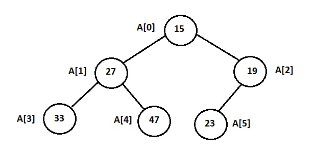

# Data Structures

## Heap
A heap is a binary tree that follows the following rules:
- **Order**
  - the key of every node is greater than or equal to the key of its children, called *maxheap* OR
  - the key of every node is smaller than or equal to the key of its children, called *minheap*.
- **Shape**
  - the tree is perfectly balanced: the leaf nodes are at most at the two lowest levels and those on the bottom level are as far left as possible.
  
Because heap is a binary tree, the height of the heap is never more than log<sub>2</sub>(n) for *n* elements.


### Heap representation
Heaps are usually implicityly represented using array (or vector) for simplicity and space efficiency. Let *A* be an array representing *n* node of a heap.

Elements    | Description
----------- | -----------
A[0]        | Root of the tree.
A[1], A[2]  | Left and right children of the root node.
A[3], A[4]  | Left and right children of A[1].
A[5], A[6]  | Left and right children of A[2].
A[7], A[8]  | Left and right children of A[3].
A[9], A[10] | Left and right children of A[4].

Use of array allows easy access to nodes while managing the tree. For a given node at index *i*,
- left and right children are located at indices *2i + 1* and *2i + 2* respectively.
- the parent node is located at index *(i - 1) / 2*.
- the elements at the bottom level starts at index *(n / 2)* in the array representation.

Here is a sample minumum heap<br>


Its implicit representation is *A[] = { 15, 27, 19, 33, 47, 23 }*.

```C++
/*
 * A basic minimum heap implementation.
 */
template<typename T>
class heap
{
private:
	vector<T> data;

	int left_child(int i) const { return 2 * i + 1; }
	int right_child(int i) const { return 2 * i + 2; }
	int parent(int i) const { return (i - 1) / 2; }

	...
};
```

### Heap Operations
**Put** Inserts an element into the heap.<br>
The new element is first inserted at the end of the vector. In the above heap, if we try to insert *7*, the heap will become:
> A[] = { 15, 27, 19, 33, 47, 23, 7 }; i.e. A[6] = 7

*A[6]*'s parent, *A[2] = 19*, is less than *A[6]* so *A[6]* is swapped with *A[2]*. 
> A[] = { 15, 27, 7, 22, 47, 23, 19 };

*A[2]*'s parent, *A[0] = 15*, is still less than *A[2]* so *A[2]* is swapped with *A[0]*.
> A[] = { 7, 27, 15, 22, 47, 23, 19 };

We have a heap again!
```C++
	... part of heap class ...

	/*
	 * Swim (percolate) up. The element at index i is
	 * moved up to its correct location in the heap.
	 */
	void swim(size_t i)
	{
		while (i > 0) {
			size_t p = parent(i);
			if (data[i] < data[p])
				swap(data[i], data[p]);
			i = p;
		}
	}

	/*
	 * Put an element to the heap.
	 */
	void put(const T &val)
	{
		data.push_back(val);
		swim(data.size() - 1);
	}

	... pary of heap class ...
```

**Get** Removes the element from the top of the heap.<br>
The top element of the heap is saved. The last element of the heap is moved in the position of the top element. Then the last element is deleted. In the above heap,

> TopElement = A[0] = 15; A[] = { 23, 27, 19, 33, 47 }; // the last element is moved at A[0] and the vector is shrinked by 1.

*A[0]* is not in the correct position. Swap *A[0]* with *min(A[1], A[2])*.
> A[] = { 19, 27, 23, 33, 47 };

We have a heap again! The *TopElement* is returned.

```C++
	... part of heap class ...

	/*
	 * Sink (percolate) down. The element at index i is
	 * moved down to its correct lacation in the heap.
	 */
	void sink(size_t i)
	{
		size_t c, l, r;

		while (i < data.size()) {
			l = left_child(i);
			r = right_child(i);

			if (l >= data.size())
				c = r;
			else if (r >= data.size())
				c = l;
			else if (data[l] < data[r])
				c = l;
			else
				c = r;

			if ((c < data.size()) && (data[c] < data[i])) {
				swap(data[c], data[i]);
				i = c;
			} else {
				break;
			}
		}
	}

	/*
	 * Get an element from the the heap.
	 * The element from the top of the heap is returned.
	 */
	T get()
	{
		T top = data[0];
		data[0] = data.back();
		data.pop_back();
		sink(0);
		return top;
	}

	... part of heap class ...
```
