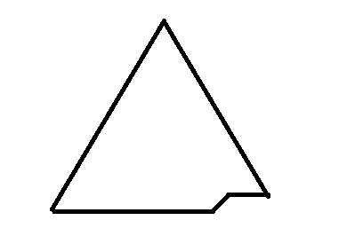

# Data Structures

## Heap
A heap is a binary tree that follows the following rules:
- **Order**
  - the key of every node is greater than or equal to the key of its children, called *maxheap* OR
  - the key of every node is smaller than or equal to the key of its children, called *minheap*.
- **Shape**
  - the tree is perfectly balanced: the leaf nodes are at most at the two lowest levels and those on the bottom level are as far left as possible.

### Heap representation
Heaps are usually implicityly represented using array (or vector) for simplicity and space efficiency. Let *A* be an array representing *n* node of a heap.
Elements    | Description
----------- | -----------
A[0]        | Root of the tree.
A[1], A[2]  | Left and right children of the root node.
A[3], A[4]  | Left and right children of A[1].
A[5], A[6]  | Left and right children of A[2].
A[7], A[8]  | Left and right children of A[3].
A[9], A[10] | Left and right children of A[4].

Use of array allows easy access to nodes while managing the tree. For a given node at index *i*,
- left and right children are located at indices *2i + 1* and *2i + 2* respectively.
- the parent node is located at index *(i - 1) / 2*.
