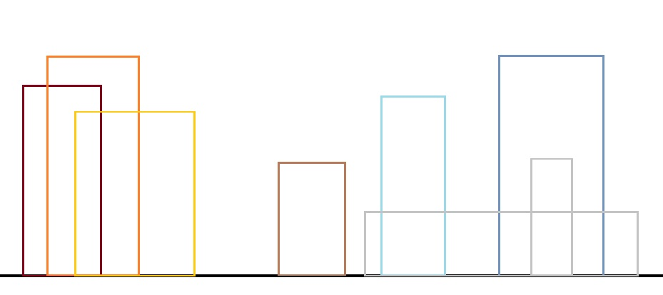
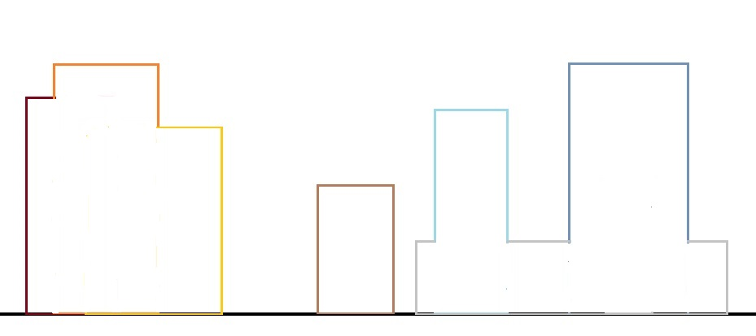
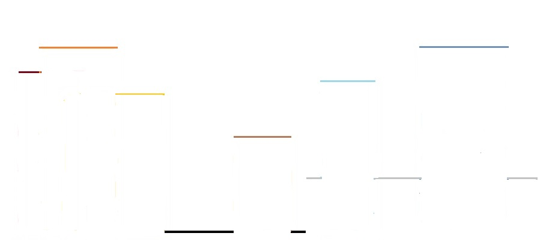
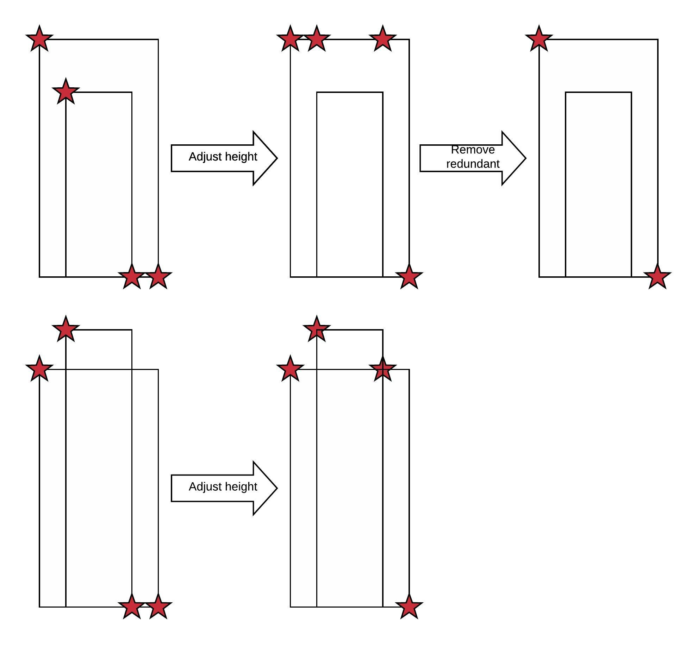
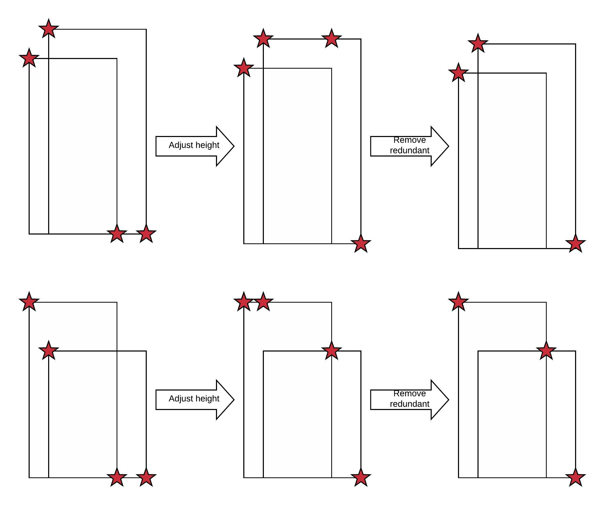

# Fun Problems

## Towers of Hanoi
*Problem:* There are 3 pegs and *n* disks of different sizes. Initially all the disks are placed on one peg in ascending order with the smallest disk on the top. The problem is to move all the disks to another peg respecting the following rules:
1. Only 1 disk can move at a time.
2. Larger disks must not be placed on the smaller one.

*Solution:* Let's call the three pegs *S(ource)*, *I(ntermediate)*, and *T(arget)*. Initially all the disks are on peg S. The goal is to move all the disks to peg T.

For *n == 1*, the solution is simple.
- Move disk from S to T.

For *n == 2*, the solution is still simple.
- Move disk from S to I.
- Move disk from S to T.
- Move disk from I to T.

For *n == 3*, the solution starts getting cumbersome.
- Move disk from S to T.
- Move disk from S to I.
- Move disk from T to I.
- Move disk from S to T.
- Move disk from I to S.
- Move disk from I to T.
- Move disk from S to T.

The essence of the process is:
1. Move *n - 1* disks from S to I.
2. Move the final *n<super>th</super>* disk to T.
3. Finally move the remaining *n - 1* disks from I to T.

Here is a rough algorithm:
```
// Move n disks from s to t using i as the intermediate.
toh(n, peg s, peg i, peg t)
{
    if (n == 1) {
        // make the final move; terminates recursion.
        move from s to t.
    } else {
        // move n - 1 disk from s to i using t as the intermediate
        toh(n - 1, s, t, i)

        // make the final move
        move from s to t

        // move n - 1 disk from i to t using s as the intermediate
        toh(n - 1, i, s, t)
    }
}
```
And here is a C++ version:
```C++
void
toh(int h, const string &s, const string &i, const string &t)
{
    if (h) {
        toh(h - 1, s, t, i);
        cout << "move disk " << h << " from " << s << " to " << t << endl;
        toh(h - 1, i, s, t);
    }
}
```

## The skyline problem
*Problem:* A set of buildings are given. Each building is defined by the following coordinates: starting/ending points on the x-axis and the height of the building on the y-axis. The input is provided as *{(s<sub>1</sub>, e<sub>1</sub>, h<sub>1</sub>), (s<sub>2</sub>, e<sub>2</sub>, h<sub>2</sub>), ... (s<sub>n</sub>, e<sub>n</sub>, h<sub>n</sub>)}*.

The problem is to find the skyline (or silhouette) of the buidlings. The skyline for the above set if buildings is

But we know only the horizontal line segments along the x-axis, it is sufficient to draw the skyline.

The solution output can thus include only the starting point of each horizontal line segment as *{(x<sub>1</sub>, y<sub>1</sub>), (x<sub>2</sub>, y<sub>2</sub>), ... (x<sub>m</sub>, y<sub>m</sub>)}*.<br>
*Solution:* The solution is not straight-forward. A few data-structures are needed before exploring the solution.
```C++
/*
 * Defines a single point on the x-y axis.
 */
struct point
{
    int x;
    int y;

    explicit point(int a, int b) : x(a), y(b) {}
    bool operator==(const point &p) { return ((p.x == x) && (p.y == y)); }
};

ostream &
operator<< (ostream &os, const point &pt)
{
    os << "(" << pt.x << ", " << pt.y << ")";
    return os;
}

/*
 * Less than operator for point. Since we move from left-to-right,
 * we are only concerned about the x-coordinate.
 */
bool
operator< (const point &p1, const point &p2)
{
    return (p1.x < p2.x);
}

/*
 * Defines a building.
 */
struct building
{
    int start;    // starting x-coordinate
    int end;    // ending x-coordinate
    int height;    // height of the building: y-coordinate

    explicit building(int x1, int x2, int h) : start(x1), end(x2), height(h) {}

    /*
     * Is the point contained in the building? A point is considered
     * with in the building if:
     * start <= p.x < end AND
     * p.y <= height.
     *
     * @return height of the building if the point is contained in the
     * building, -1 if the building does not contain the point.
     */
    int contains(const point &p) const
    {
        if ((p.x >= start) && (p.x < end) && (p.y <= height))
            return height;
        return -1;
    }
};

/*
 * Less than operator for building. Since we move from left-to-right,
 * we are only concerned about the start.
 */
bool
operator< (const building &b1, const building &b2)
{
    return (b1.start < b2.start);
}

```
The following code snippet reads the building coordinates. It saves buildings in a vector.
```C++
int x1, x2, h;
vector<building> buildings;

fstream fin(<file-containing-building-coordinates>, ios_base::in);
while (fin >> x1 >> x2 >> h)
        buildings.emplace_back(x1, x2, h);
fin.close();
```

### Key Points
The **key** (or **critical**) points of a building are top-left and bottom-right coordinates of a building. If a single building is taken, the key points define the skyline of the building.

### General approach
The general approach to solve the problem is:
* adjust the height of key points.
* remove redundant key points.

Some examples here:



### Approach 1 (Look at all the buildings to determine the height of a key point)
1. All the key points are added to the skyline.
2. The y-coordinate (or height) of each key point is adjusted such that it is the highest point in all buildings containing the key point.
3. The key points are sorted.
4. Redundant key points deleted.

To adjust the key point heights, we can possibly check *n* buildings for every building. As such, this algorithm has a complexity of *n * n* or *n<sup>2</sup>*.
```C++
/*
 * Remove redundant key points along the same y-axis (retaining the lowest x-axis point).
 * Input:  { (x1, y1), (x2, y1), (x3, y2), (x4, y3), (x5, y3), (x6, y4) }
 * Output: { (x1, y1), (x3, y2), (x4, y3), (x6, y4) }
 */
static void
remove_redundant(vector<point> &keypoints)
{
    vector<point>::iterator i, j;

    i = j = keypoints.begin();
    if (i != keypoints.end())
        i++;

    while (i != keypoints.end()) {
        if (j->y != i->y) {
            j++;
            *j = *i;
        }
        i++;
    }

    if (j != keypoints.end())
        keypoints.erase(j + 1, keypoints.end());
}

/*
 * Solves the skyline problem.
 *
 * @param [in] buildings - the set of input buildings.
 *
 * @return the skyline.
 */
vector<point>
skyline_v1(const vector<building> &buildings)
{
    vector<point> keypoints;

    /*
     * Add all key points: top-left and bottom-right corners.
     */
    for (auto b : buildings) {
        keypoints.emplace_back(b.start, b.height);
        keypoints.emplace_back(b.end, 0);
    }

    /*
     * Update height (y-coordinate) of each keypoint.
     * It must be the highest building height containing the keypoint.
     */
    vector<point>::iterator i;
    for (i = keypoints.begin(); i != keypoints.end(); ++i) {
        int h = i->y;

        vector<building>::const_iterator k;
        for (k = buildings.begin(); k != buildings.end(); ++k)
            h = max(h, k->contains(*i));

        i->y = h;
    }

    /* Sort keypoints */
    sort(keypoints.begin(), keypoints.end());

    /* Remove duplicates */
    remove_redundant(keypoints);

    return keypoints;
}
```

### Approach 2 (Grow skyline by adding one building at a time)
1. Start with empty skyline.
2. Add a building at a time.
3. Adding a building is effectively merging the building's skyline to the overall skyline.

To add *i<sup>th</sup>* building to the existing skyline, we need to check the skyline of *(i - 1)* buildings. This is slightly better in proactive but the complexity is still *n<sup>2</sup>*.
```C++
/*
 * Add building to the skyline.
 *
 * @param [in] kp1 - the existing skyline.
 * @param [in] b   - the building to add.
 *
 * @return the final skyline.
 */
vector<point>
add_building(const vector<point> &kp1, const building &b)
{
    vector<point> keypoints;
    vector<point> kp2;

    kp2.emplace_back(b.start, b.height);
    kp2.emplace_back(b.end, 0);

    int h1 = 0; // last height in kp1 skyline
    int h2 = 0; // last height in kp2 skyline

    vector<point>::const_iterator i = kp1.begin();
    vector<point>::const_iterator j = kp2.begin();

    /*
     * Choose the keypoint with smaller x-coordinate.
     * Adjust the y-coordinate of the skyline. The y-coordinate is
     * the maximum of y-coordinate and the last height of the
     * other skyline.
     */
    while ((i != kp1.end()) && (j != kp2.end())) {
        if (i->x < j->x) {
            keypoints.emplace_back(i->x, max(i->y, h2));
            h1 = i->y;
            i++;
        } else if (i->x == j->x) {
            keypoints.emplace_back(i->x, max(i->y, j->y));
            h1 = i->y;
            h2 = j->y;
            i++;
            j++;
        } else /* if (i->x > j->y) */ {
            keypoints.emplace_back(j->x, max(h1, j->y));
            h2 = j->y;
            j++;
        }
    }

    /*
     * Take care of the remaining key points.
     */

    while (i != kp1.end()) {
        keypoints.push_back(*i);
        i++;
    }

    while (j != kp2.end()) {
        keypoints.push_back(*j);
        j++;
    }

    /* Remove duplicates */
    remove_redundant(keypoints);

    return keypoints;
}

/*
 * Solves the skyline problem.
 *
 * @param [in] buildings - the set of input buildings.
 *
 * @return the skyline.
 */
vector<point>
skyline_v2(const vector<building> &buildings)
{
    vector<point> keypoints;

    /*
     * Add one building at a time.
     */
    for (auto b : buildings)
        keypoints = std::move(add_building(keypoints, b));

    return keypoints;
}
```

### Approach 3 (Merge skylines)
This approach uses *divide and conquer*. The problem with *n* building is divided into two *n / 2* sub problems. The process is repeated until we are left with 1 building. The skylines are then merged as recursion unwinds.

The complexity is *n * log<sub>2</sub>(n)*.
```C++
/*
 * Merge two skylines. Not very different from add_building.
 *
 * @param [in] kp1 - the first skyline.
 * @param [in] kp2 - the second skyline.
 *
 * @return the merged skyline.
 */
vector<point>
merge_skylines(const vector<point> &kp1, const vector<point> &kp2)
{
    vector<point> keypoints;
    int h1 = 0; // last height in kp1 skyline
    int h2 = 0; // last height in kp2 skyline

    vector<point>::const_iterator i = kp1.begin();
    vector<point>::const_iterator j = kp2.begin();

    /*
     * Choose the keypoint with smaller x-coordinate.
     * Adjust the y-coordinate of the skyline. The y-coordinate is
     * the maximum of y-coordinate and the last height of the
     * other skyline.
     */
    while ((i != kp1.end()) && (j != kp2.end())) {
        if (i->x < j->x) {
            keypoints.emplace_back(i->x, max(i->y, h2));
            h1 = i->y;
            i++;
        } else if (i->x == j->x) {
            keypoints.emplace_back(i->x, max(i->y, j->y));
            h1 = i->y;
            h2 = j->y;
            i++;
            j++;
        } else /* if (i->x > j->y) */ {
            keypoints.emplace_back(j->x, max(h1, j->y));
            h2 = j->y;
            j++;
        }
    }

    /*
     * Take care of the remaining key points.
     */

    while (i != kp1.end()) {
        keypoints.push_back(*i);
        i++;
    }

    while (j != kp2.end()) {
        keypoints.push_back(*j);
        j++;
    }

    /* Remove duplicates */
    remove_redundant(keypoints);

    return keypoints;
}

/*
 * Merge skylines recursively.
 *
 * @param [in] buildings - the set of input buildings.
 * @param [in] lo        - the start of buildings.
 * @param [in] hi        - the end of buildings (inclusive).
 *
 * @return the skyline.
 */ 
vector<point>
skyline_recursive(const vector<building> &buildings, size_t lo, size_t hi)
{
    if (lo == hi) {
        vector<point> kp;
        kp.emplace_back(buildings[lo].start, buildings[lo].height);
        kp.emplace_back(buildings[lo].end, 0);
        return kp;
    } else {
        size_t mid = (lo + hi) / 2;
        vector<point> kp1 = std::move(skyline_recursive(buildings, lo, mid));
        vector<point> kp2 = std::move(skyline_recursive(buildings, mid + 1, hi));
        return merge_skylines(kp1, kp2);
    }
}

/*
 * Solves the skyline problem.
 *
 * @param [in] buildings - the set of input buildings.
 *
 * @return the skyline.
 */
vector<point>
skyline_v3(const vector<building> &buildings)
{
    if (buildings.empty()) {
        return vector<point> ();
    }

    return skyline_recursive(buildings, 0, buildings.size() - 1);
}
```

## The Celebrity Problem
*Problem:* There are *n* people in a room. At most, there is a *1* celebrity. There are following 3 rules:
* Everyone knows the celebrity.
* The celebrity does not know anyone.
* The other, non-celebrities, might or might not know anyone else.

The problem is to find the celebrity, if any, in the room.

*Solution:* 
Let's define a person object. It contains the person name and a list of people it knows. Another more compact way is to maintain a 2-dimensional, *n x n*, array of booleans, say *people*. *people[A]\[B]* is true if *A* knows *B* and false otherwise. 
```C++
/*
 * Defines a person and a sequence of people known.
 */
struct person
{
    string          name;   // your name
    vector<string>  known;  // people you know

    /*
     * Name and comma-separated people known.
     * If the people known is 'nil', then the person
     * knows no one and is a candidate to be celebrity.
     */
    explicit person(const string &n, const string &k)
        : name(n)
    {
        stringstream ss(k);

        while (ss.good()) {
            string val;
            getline(ss, val, ',');
            if (!val.empty() && (val != "nil"))
                known.push_back(val);
        }
    }

    /* Does this person knows 'someone'? */
    bool knows(const string &someone) const
    {
        for (auto s : known) {
            if (s == someone)
                return true;
        }
        return false;
    }
};
```
People could be read from a file with the format:
```
<name> <comma-sepated-known-people>
<name> nil
```
In the following example, C is the celebrity.
```
A B,C
B C,D
C nil
D B,C,E
E C
F C,G
G C
```
The following code snippet could be used to populate the a vector of person:
```C++
string name, known;
vector<person> people;

fstream fin(argv[1], ios_base::in);
while (fin >> name >> known)
    people.emplace_back(name, known);
fin.close();
```
The problem could be easily solved using just 2 passes through the sequence of people as illustrated below:
```C++
/*
 * Find celebrity.
 */
string
find_celebrity(const vector<person> &people)
{
    // Let the first person be the celebrity.
    size_t celeb = 0;

    /*
     * If he knows the next person, then he is not
     * a celebrity. Assign the next person as the
     * celebrity.
     */
    for (size_t i = 1; i < people.size(); ++i) {
        if (people[celeb].knows(people[i].name))
            celeb = i;
    }

    /*
     * If there is a celebrity, we will know it by now.
     * Make sure we are correct and handle the case when
     * there is no celebrity.
     */

    for (size_t i = 0; i < people.size(); ++i) {
        if (i != celeb) {
            /*
             * If people[i] does not know the celebrity (OR)
             * if the celebrity knows the people[i], then
             * people[celeb] is not a celebrity.
             */
            if (!people[i].knows(people[celeb].name) ||
                people[celeb].knows(people[i].name)) {
                return string();
            }
        }
    }

    return people[celeb].name;
}
```

## Finding a majority
*Problem:* Given a sequence of integers, *S = { i<sub>1</sub>, i<sub>2</sub>, i<sub>3</sub>, ... i<sub>n - 1</sub>, i<sub>n</sub> }*, find the majority in the sequence. It is possible that no majority is found. But what exactly is a majority? The number of times a number appears in a sequence of *n* integers is called its **multiplicity** and majority is a number that has a multiplicity greater than *n / 2*. In short, a majority is a number in a sequence of *n* integers is the one that appears more than *n /2* times.

*Solution:* The solution is inspired by **the celebrity problem**. We make two passes through the sequence. In the firt pass, we find an integer that occurs more times than any other integer. In the second pass, we count the number of times the integer occurs. The algorithm's complexity is *2 * n*.
```C++
/*
 * Find majority in the sequence.
 */
int
majority(const vector<int> &seq)
{
    int candidate = seq[0]; // possible candidate
    int frequency = 1;      // its frequency

    for (size_t i = 1; i < seq.size(); ++i) {
        if (seq[i] == candidate) {
            frequency++;
        } else {
            frequency--;
            if (frequency == 0) {
                candidate = seq[i];
                frequency = 1;
            }
        }
    }

    size_t multiplicity = 0;

    if (frequency) {
        /*
         * There is a possibility that we have a majority.
         * 'frequency' is not the real frequency. A +ve
         * frequency simply means that there is a candidate
         * that occurs more times than any other integer.
         */
        for (size_t i = 0; i < seq.size(); ++i) {
            if (seq[i] == candidate)
                multiplicity++;
        }
    }

    return (multiplicity <= seq.size() / 2) ? -1 : candidate;
}
```

## Maximum Consecutive Subsequence
*Problem:* Given a sequence of real numbers (-ve allowed), *S = { r<sub>1</sub>, r<sub>2</sub>, r<sub>3</sub>, ... r<sub>n - 1</sub>, r<sub>n</sub> }*, find the maximum sum of a consecutive subsequence i.e. find *SS = { r<sub>i</sub>, r<sub>i + 1</sub>, ... r<sub>i + k - 1</sub>, r<sub>i + k</sub> }* whose sum is maximal. The maximum sum of an empty sequence is 0.<br>
*Solution:* Keep track of the sum of current consecutive subsequence and the maximum consecutive subsequence values seen so far separately at each iteration. Since we only make one pass through the sequence, the complexity is *n*.
```C++
double
max_cons_subseq(const vector<double> &seq)
{
    double v = 0.0; // +ve value of a subsequence
    double V = 0.0; // maximum value of subsequence seen so far

    for (size_t i = 0; i < seq.size(); ++i) {
        v += seq[i];
        v = max(v, 0.0);
        V = max(v, V);
    }

    return V;
}
```
A small variation to the problem is to not only find the maximal value but also the subsequence. The problem can be solved similarly by keeping track of start and end indices for current consecutive subsequence and the maximum consecutive subsequence.
```C++
double
max_cons_subseq(const vector<double> &seq, size_t &start, size_t &end)
{
    double v = 0.0; // +ve value of a subsequence
    size_t s, e;    // start and end of a subsequence
    double V = 0.0; // maximum value of subsequence seen so far
    size_t S, E;    // start and end of a maximum subsequence seen so far

    // Initialize start and end of the current and maximal subsequences.
    s = S = e = E = seq.size();

    for (size_t i = 0; i < seq.size(); ++i) {
        v += seq[i];
        if (v > 0.0) {
            if (s == seq.size())
                s = e = i;
            else 
                e = i;
        } else {
            s = e = seq.size();
        }

        v = max(v, 0.0);
        if (v > V) {
            S = s;
            E = e;
            V = v;
        }
    }

    start = S;
    end = E;
    return V;
}
```

## Find Maximum and Minimum Items
*Problem:* Given a sequence of *n* items, find the maximum and the minumum elements.

*Solution:* A simple problem where the most obvious solution has plenty of scope for improvements.

### Approach 1 (Scan the sequence twice)
The sequence is scanned to find the minimum item. This involves *n - 1* comparisons. The sequence is scanned again to find the maximum item. This again involves *n - 1* comparisons. Overall there are *2n* comparisons.
```C++
/*
 * Scan the sequence twice: once to find the minumum
 * and the next time to find the maximum. Each scan
 * incurs n - 1 comparisons. So we need:
 * (n - 1) + (n - 1) = ~2n comparisons.
 */
void
minmax_v1(const vector<int> &seq, int &min, int &max)
{
    if (seq.empty())
        return;

    min = max = seq[0];

    for (size_t i = 1; i < seq.size(); ++i) {
        if (seq[i] < min)
            min = seq[i];
    }

    for (size_t i = 1; i < seq.size(); ++i) {
        if (seq[i] > max)
            max = seq[i];
    }
}
```

### Approach 2 (Scan the sequence once)
The sequence is scanned only once. If the item is greater than the maximum item seen so far then the new maximum is fixed, else if the item is lower than the minumum seen so far then the new minumum is fixed.
```C++
/*
 * Scan the sequence only once.
 * If an item is larger than the maximum, then it cannot be
 * less than the minumum. This fact helps us to knock out a
 * few comparison. But overall it is not much better.
 */
void
minmax_v2(const vector<int> &seq, int &min, int &max)
{
    if (seq.empty())
        return;

    min = max = seq[0];

    for (size_t i = 1; i < seq.size(); ++i) {
        if (seq[i] > max)
            max = seq[i];
        else if (seq[i] < min)
            min = seq[i];
    }
}
```

### Approach 3 (Scan the sequence once; look at two items at a time)
This is by far the best approach. Two items are processed together as the sequence is scanned. The items are compared to find the local minumum, *mn*, and the local maximum, *mx*. *mn* is then compared with global minimum, *min*, to fix the global minumum seen so far. Likewise, *mx* is compared with global maximum, *max*, to fix the global maximum seen so far. Since there are 3 comparisons for every 2 items, there are 3n/2 comparisons.
```C++
/*
 * Scan the sequence only once.
 * Instead of processing 1 item at a time, process 2 items
 * at once. Compare and find local min and max. Compare the
 * local max with global max and find the new global max.
 * Compare the local min with global min and find the new
 * global min. So by scanning 2 items at a time, we need
 * 3 comparisons to find the new maximum and the new minimum.
 * In general, we need 3n/2 comparisons.
 */
void
minmax_v3(const vector<int> &seq, int &min, int &max)
{
    if (seq.empty())
        return;

    min = max = seq[0];

    for (size_t i = 1; i < seq.size(); i += 2) {
        if ((i + 1) == seq.size()) {
            if (seq[i] > max)
                max = seq[i];
            else if (seq[i] < min)
                min = seq[i];
        } else {
            int mx, mn;

            if (seq[i] < seq[i + 1]) {
                mn = seq[i];
                mx = seq[i + 1];
            } else {
                mn = seq[i + 1];
                mx = seq[i];
            }

            if (mx > max)
                max = mx;
            if (mn < min)
                min = mn;
        }
    }
}
```

### Approach 4 (Divide and Conquer)
This is very similar to the previous approach though it done using *divide and conquer* and uses recursion. The minimum and the maximum items for the smaller subsets are calculated. The results from the smaller subsets are used to solve the bigger subsets until the whole set is solved. It requires *n + 2<sup>log<sub>2</sub>(n)</sup>* comparisons.
```C++
static void
minmax_v4(const vector<int> &seq, size_t lo, size_t hi, int &min, int &max)
{
    if (lo >= hi)
        return;

    if ((hi - lo) == 1) {
        min = max = seq[lo];
    } else if ((hi - lo) == 2) {
        if (seq[lo] < seq[hi]) {
            min = seq[lo];
            max = seq[lo + 1];
        } else {
            max = seq[lo];
            min = seq[lo + 1];
        }    
    } else {
        int min_l, max_l;
        int min_r, max_r;
        size_t mid = (lo + hi) / 2;

        minmax_v4(seq, lo, mid, min_l, max_l);
        minmax_v4(seq, mid, hi, min_r, max_r);

        max = max_l;
        if (max < max_r)
            max = max_r;

        min = min_l;
        if (min > min_r)
            min = min_r;
    }

    return;
}

/*
 * Divide and Conquer.
 */
void
minmax_v4(const vector<int> &seq, int &min, int &max)
{
    minmax_v4(seq, 0, seq.size(), min, max);
}
```

## Find Two Largest Items
*Problem:* Given a sequence of *n* items, find the largest and the second largest item.

*Solution:*

### Approach 1 (Simple scan)
Scan the sequence finding the largest and the second largest items. Roughly *2n* comparisons.
```C++
/*
 * Two largest items in the sequence.
 *
 * @param [in]  seq    - the input sequence.
 * @param [out] large1 - the largest item.
 * @param [out] large2 - the second largest item.
 */
void
two_largest_v1(const vector<int> &seq, int &large1, int &large2)
{
    for (size_t i = 0; i < seq.size(); ++i) {
        if (seq[i] > large1) {
            large2 = large1;
            large1 = seq[i];
        } else if (seq[i] > large2) {
            large2 = seq[i];
        }
    }
}
```

### Approach 2 (Naive Divide and Conquer)
The largest and the second largest items for the smaller subsets are calculated. The results from the smaller subsets are used to solve the bigger subsets until the whole set is solved. It requires *n + 2<sup>log<sub>2</sub>(n)</sup>* comparisons.
```C++
static void
two_largest_v2(const vector<int> &seq, size_t lo, size_t hi, int &large1, int &large2)
{
    if (lo >= hi)
        return;

    if ((hi - lo) == 1) {
        large1 = seq[lo];
    } else if ((hi - lo) == 2) {
        if (seq[lo] > seq[lo + 1]) {
            large1 = seq[lo];
            large2 = seq[lo + 1];
        } else {
            large1 = seq[lo + 1];
            large2 = seq[lo];
        }
    } else {
        int p1, p2;
        int q1, q2;

        size_t mid = (lo + hi) / 2;
        two_largest_v2(seq, lo, mid, p1, p2);
        two_largest_v2(seq, mid, hi, q1, q2);

        if (p1 > q1) {
            large1 = p1;
            if (p2 > q1)
                large2 = p2;
            else
                large2 = q1;
        } else {
            large1 = q1;
            if (q2 > p1)
                large2 = q2;
            else
                large2 = p1;
        }
    }
}

/*
 * Two largest items in the sequence using naive
 * divide and conqueuer.
 *
 * @param [in]  seq    - the input sequence.
 * @param [out] large1 - the largest item.
 * @param [out] large2 - the second largest item.
 */
void
two_largest_v2(const vector<int> &seq, int &large1, int &large2)
{
    two_largest_v2(seq, 0, seq.size(), large1, large2);
}
```

### Approach 3 (Smart Divide and Conquer)
This is basically *divide and conquer* with recursion to find:
- the largest element
- the candidates, in the form of a small sequence, for the second largest element.

The second largest element is then found by scanning the candidates for the second largest element sequence. This is extremely efficient and involves only *n + log<sub>2</sub>(n)* comparisons.
```C++
static void
two_largest_v3(const vector<int> &seq, size_t lo, size_t hi, int &large1, vector<int> &large2_choices)
{
    if (lo >= hi)
        return;

    if ((hi - lo) == 1) {
        large1 = seq[lo];
    } else if ((hi - lo) == 2) {
        if (seq[lo] > seq[lo + 1]) {
            large1 = seq[lo];
            large2_choices.push_back(seq[lo + 1]);
        } else {
            large1 = seq[lo + 1];
            large2_choices.push_back(seq[lo]);
        }
    } else {
        int p1; vector<int> p2_choices;
        int q1; vector<int> q2_choices;

        size_t mid = (lo + hi) / 2;
        two_largest_v3(seq, lo, mid, p1, p2_choices);
        two_largest_v3(seq, mid, hi, q1, q2_choices);

        if (p1 > q1) {
            large1 = p1;
            large2_choices.push_back(q1);
            for (auto l2 : p2_choices)
                large2_choices.push_back(l2);
            // q2_choices is completely ignored.
        } else {
            large1 = q1;
            large2_choices.push_back(p1);
            for (auto l2 : q2_choices)
                large2_choices.push_back(l2);
            // p2_choices is completely ignored.
        }
    }
}

/*
 * Two largest items in the sequence using smart
 * divide and conqueuer.
 *
 * @param [in]  seq    - the input sequence.
 * @param [out] large1 - the largest item.
 * @param [out] large2 - the second largest item.
 */
void
two_largest_v3(const vector<int> &seq, int &large1, int &large2)
{
    vector<int> large2_choices;

    two_largest_v3(seq, 0, seq.size(), large1, large2_choices);

    for (size_t i = 0; i < large2_choices.size(); ++i) {
        if (large2_choices[i] > large2)
            large2 = large2_choices[i];
    }
}
```

## Rotate an array at a given disance

- *Input* An array of length N, say [ 1, 2, 3, 4, 5, 6, 7 ] and rotation distance D, say 4.
- *Output* The rotated array i.e. [ 5, 6, 7, 1, 2, 3, 4 ]

### Approach 1 (by reversing)

Let's assume that the array is made up of two parts - `a` and `b`.
```
 <--- a -->
 1, 2, 3, 4, 5, 6, 7
             <- b ->
```
Reversing the whole array gives us:
```
 <- B ->
 7, 6, 5, 4, 3, 2, 1
          <--- A -->
```
A = a<sub>reverse</sub><br>
B = b<sub>reverse</sub><br>
This means that if we first reverse a and b and then reverse the whole string, we will get the rotated array.

```
Original array
 <--- a -->
 1, 2, 3, 4, 5, 6, 7 
             <- b ->
Reverse a
<--- A -->
4, 3, 2, 1, 5, 6, 7
            <- b ->
Reverse b
<--- A -->
4, 3, 2, 1, 7, 6, 5
            <- B ->
Reverse AB
5, 6, 7, 1, 2, 3, 4
```

```
algorithm: rotate
    input: array { integer, N } : seq,  # A sequence of N items
           integer: D                   # Rotation distance
    output: array { integer, N }        # The same sequence with items rotated
begin
    reverse seq [0, D)                  # include 0, exlude D
    reverse seq [D, N)                  # include D, exclude N
    reverse seq [0, N)                  # include 0, exclude N
    return seq;
end
```

### Approach 2 

This approach is really tricky. Let's look at the algorithm first and some examples:

```
algorithm: rotate
    input: array { integer, N } : seq,  # A sequence of N items
           integer: D                   # Rotation distance
    output: array { integer, N }        # The same sequence with items rotated
begin
    integer: gcd
    gcd = greatest common divisor of N and D
    for index = [0, gcd)                # include 0, exclude gcd
    begin
        integer: current, next
        integer: temp

        current = index                 # Start at index
        temp = seq[current]             # Save the start element

        forever
        begin
            next = current + D          # Get the next element
            if next >= N                # The next element is beyond array bounds
                next -= N               # Adjust accordingly
            if next == index            # Rotated all in the current round
                break
            seq[current] = seq[next]    # Move element at seq[start + D] to seq[start]
            current = next              # Move ahead by D elements
        end

        seq[current] = temp             # Move the saved element to the final start location.
    end
end
```

```
Example 1: seq = [ 1, 2, 3, 4, 5, 6, 7, 8 ], N = 8, D = 2

gcd = 2
outer-loop-iteration-0:
    index = 0
    current = 0
    temp = 1
    inner-loop-iteration-0:
        next = 2
        seq = [ 3, 2, 3, 4, 5, 6, 7, 8 ]
        current = 2
    inner-loop-iteration-1:
        next = 4
        seq = [ 3, 2, 5, 4, 5, 6, 7, 8 ]
        current = 4
    inner-loop-iteration-2:
        next = 6
        seq = [ 3, 2, 5, 4, 7, 6, 7, 8 ]
        current = 6
    inner-loop-iteration-3:
        next = 0
        break;
    seq = [ 3, 2, 5, 4, 7, 6, 1, 8 ]
outer-loop-iteration-1:
    index = 1
    current = 1
    temp = 2
    inner-loop-iteration-0:
        next = 3
        seq = [ 3, 4, 5, 4, 7, 6, 1, 8 ]
        current = 3
    inner-loop-iteration-1:
        next = 5
        seq = [ 3, 4, 5, 6, 7, 6, 1, 8 ]
        current = 5
    inner-loop-iteration-2:
        next = 7
        seq = [ 3, 4, 5, 6, 7, 8, 1, 8 ]
        current = 7
    inner-loop-iteration-3:
        next = 0
        break;
    seq = [ 3, 4, 5, 6, 7, 8, 1, 2 ]

Example 2: seq = [ 1, 2, 3, 4, 5, 6, 7, 8 ], N = 8, D = 3

gcd = 1
outer-loop-iteration-0:
    index = 0
    current = 0
    temp = 1;
    inner-loop-iteration-0:
        next = 3
        seq = [ 4, 2, 3, 4, 5, 6, 7, 8 ]
        current = 3
    inner-loop-iteration-1:
        next = 6
        seq = [ 4, 2, 3, 7, 5, 6, 7, 8 ]    
        current = 6
    inner-loop-iteration-2:
        next = 1
        seq = [ 4, 7, 3, 7, 5, 6, 2, 8 ]
        current = 1
    inner-loop-iteration-3:
        next = 4
        seq = [ 4, 5, 3, 7, 7, 6, 2, 8 ]
        current = 4
    inner-loop-iteration-4:
        next = 7
        seq = [ 4, 5, 3, 7, 8, 6, 2, 8 ]
        current = 7
    inner-loop-iteration-5:
        next = 2
        seq = [ 4, 5, 3, 7, 8, 6, 2, 3 ]
        current = 2
    inner-loop-iteration-6:
        next = 5
        seq = [ 4, 5, 6, 7, 8, 6, 2, 3 ]
        current = 5
    inner-loop-iteraton-7
        next = 0
        break
    seq =  [ 4, 5, 6, 7, 8, 1, 2, 3 ]
```

## Anagrams

### Given a dictionary of words, find all sets of anagrams
Given a dictionary of words (as a list/array of strings), find all sets of anagrams. If the dictionary has the following words:
```
care
dare
no
on
pots
race
read
stop
tops
```
The response should be:
```
care race
dare read
no on
pots stop tops
```

The solution has two main components:
1. Word signature. The signature of the word is such that all the anagrams yield the same signature irrespective of the placement of letters in the word. One such algorithm is to sort the letters of the word i.e. signature of `pots`, `stop`, and `tops` is `opst`. 
2. Maintains a map of signature to a list of the words with the same signature i.e. `word_map[opst] = [ pots, stop, tops ]`.

```
algorithm: anagrams
    input: list { string } : words                  # A list of words in the dictionary
    output: list { list { string } }                # A list of list of words that are anagrams
begin
    map { string, list { string } } : word_map      # Map of signature to list of words

    foreach word of words                           # Pre-process dictionary
    begin
        string : sign
        sign = signature(word)                      # Get word signature.
        if not word_map.has(sign)                   # If the signature has not been seen before
        then
            word_map[sign] = new()                  # Create a new list
        end
        word_map[sign].append(word)                 # Append the word to the list
    end

    list { list { string } } : response
    foreach kvpair of word_map                      # Go through the word_map
    begin
        if kvpair.size > 1                          # If a signature has more that one word,
        then
            response.append(kvpair.value)           # add the words to the map
        end
    end

    return response
end
```