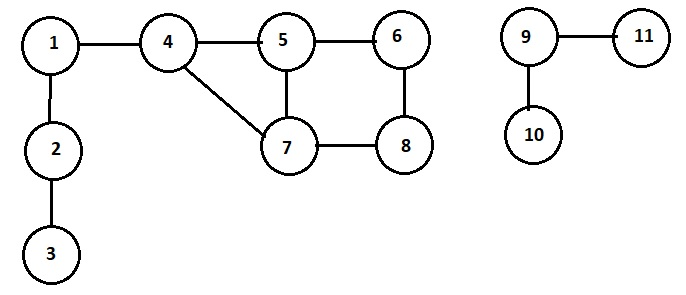
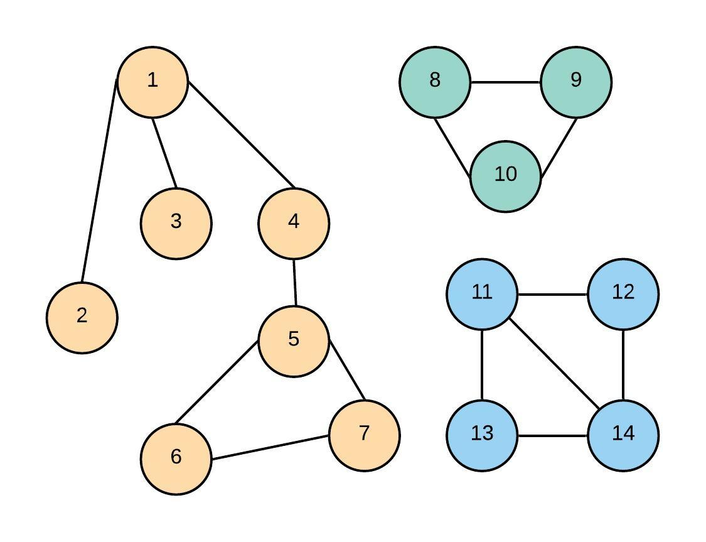
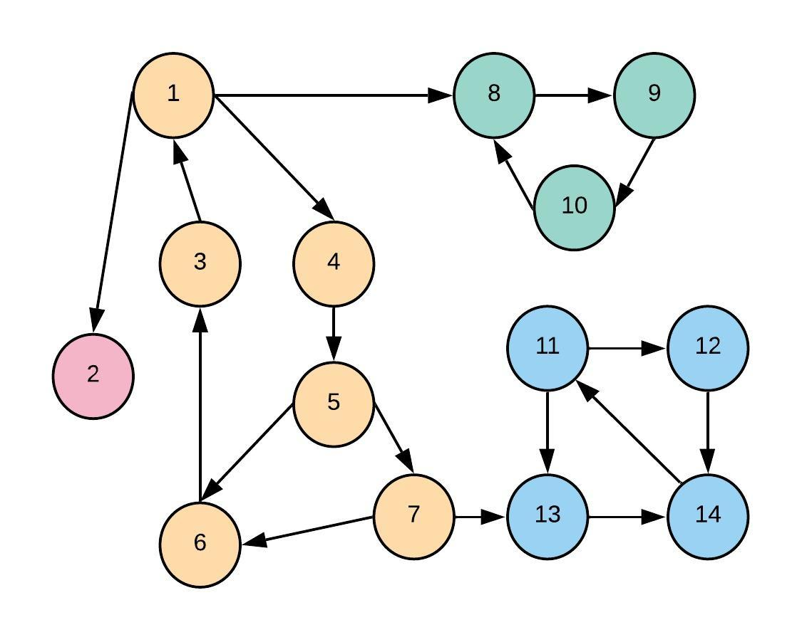

# Graphs

A graph, **G = (V, E)**, is a data structure that consists of **V** vertices and **E** edges.
An edge connects two vertices and is represented by a pair of the two vertices it connects, (*v<sub>1</sub>*, *v<sub>2</sub>*).
A graph could be:
* **directed**, also called **digraph**, with a sense of direction, where an edge is an ordered pair (*v<sub>1</sub>*, *v<sub>2</sub>*),
* **undirected** where an edge is an unordered pair (*v<sub>1</sub>*, *v<sub>2</sub>*) and (*v<sub>2</sub>*, *v<sub>1</sub>*).



## Graph representation
* Adjacency matrix *undirected*
```
    1  2  3  4  5  6  7  8  9 10 11
1   0  1  0  1  0  0  0  0  0  0  0
2   1  0  1  0  0  0  0  0  0  0  0  
3   0  1  0  0  0  0  0  0  0  0  0
4   1  0  0  0  1  0  1  0  0  0  0
5   0  0  0  1  0  1  1  0  0  0  0
6   0  0  0  0  1  0  0  1  0  0  0
7   0  0  0  1  1  0  0  1  0  0  0
8   0  0  0  0  0  1  1  0  0  0  0
9   0  0  0  0  0  0  0  0  0  1  1
10  0  0  0  0  0  0  0  0  1  0  0
11  0  0  0  0  0  0  0  0  1  0  0
```
* Adjacency list *undirected*
```
1  -> 2, 4
2  -> 1, 3
3  -> 2
4  -> 1, 5, 7
5  -> 4, 6, 7
6  -> 5, 8
7  -> 4, 5, 8 
8  -> 6, 7
9  -> 10, 11
10 -> 9
11 -> 9
```
Adjancency list is the most common representation used for graph. Here is a possible C++ implementation:
```C++
/*
 * Vertex of a graph.
 */
template<typename T>
struct vertex
{
	T           vrtx;       // the vertex itself
	vector<T>   adjacent;   // adjacent vertices

	explicit vertex(T v) : vrtx(v) {}
	bool operator==(T v) const { return (this->vrtx == v); }
};

/*
 * Graph implementation.
 */
template<typename T>
class graph
{
private:
	bool                directed;       // directed or undirected?
	size_t              count;          // number of vertices
	vector<vertex<T>>   vertices;       // vertices in the graph

	/*
	 * Get a vertex, v.
	 * Throws out_of_range exception if the vertex is not found.
	 */
	vertex<T> & get_vertex(const T &v)
	{
		typename vector<vertex<T>>::iterator it = find(vertices.begin(), vertices.end(), v);
		if (it == vertices.end()) {
			ostringstream oss;
			oss << "vertex " << v << " not found";
			throw out_of_range(oss.str());
		} else {
			return *it;
		}
	}

	/*
	 * Add an edge (from, to).
	 */
	void add_edge(vertex<T> &from, const vertex<T> &to)
	{
		if (from.adjacent.end() == find(from.adjacent.begin(), from.adjacent.end(), to.vrtx))
			from.adjacent.push_back(to.vrtx);
	}

public:
	graph(bool dir = true) : directed(dir), count(0) {}

	/*
	 * Add a vertex, v.
	 */
	void add_vertex(const T &v)
	{
		typename vector<vertex<T>>::iterator it = find(vertices.begin(), vertices.end(), v);
		if (it == vertices.end()) {
			vertices.emplace_back(v);
			++count;
		}
	}

	/*
	 * Get a vertex, v.
	 * Throws out_of_range exception if the vertex is not found.
	 */
	const vertex<T> & get_vertex(const T &v) const
	{
		typename vector<vertex<T>>::const_iterator it = find(vertices.begin(), vertices.end(), v);
		if (it == vertices.end()) {
			ostringstream oss;
			oss << "vertex " << v << " not found";
			throw out_of_range(oss.str());
		} else {
			return *it;
		}
	}

	/*
	 * Add an edge (from, to). If the graph is undirected, edge (to, from)
	 * is added as well.
	 */
	void add_edge(const T &from, const T &to)
	{
		add_vertex(from);
		add_vertex(to);

		vertex<T> &v1 = get_vertex(from);
		vertex<T> &v2 = get_vertex(to);

		add_edge(v1, v2);
		if (!directed)
			add_edge(v2, v1);
	}

	bool is_directed() const { return directed; }
	size_t num_vertices() const { return count; }
	const vector<vertex<T>> &get_vertices() const { return vertices; }
};
```

## Degree of a vertex
The number of edges coming out of a vertex is the degree of that edge.
```C++
	// Part of graph class

	/*
	 * Find the degree of an vertex, v.
	 */
	size_t degree(T v) const
	{
		return get_vertex(v).adjacent.size();
	}
```

## Graph Traversal
There are two main graph traversal methods based on the order in which the vertices are visited:
* **Depth First Search (DFS)** A very popular approach suitable to recursion. An arbitrary vertex is chosen. The action needed on the vertex is performed and the vertex is marked as *visited*. Then an adjacent, unvisited, vertex is picked up arbitrarily. The action needed is performed and that vertex is marked as *visited* as well. The process continues, as we go deeper into the graph, until all the connected vertices are processed and marked as *visited*. The data structure used to save the *unexplored* vertices is stack and that makes it apt for recursion.
* **Breadth First Search (BFS)** An organized approach were vertices are visited level by level. An arbitrary vertex is chosen. The action needed on the vertex is performed and the vertex is marked as *visited*. Next all adjacent, unvisited, vertices are processed and marked as *visited*. The process continues until all the vertices at all levels are processed and marked as *visited*. The data structure used to save the *unexplored* vertices is queue. BFS gives the **shortest path** between any two vertices of the graph.

We need a data structure to do processing at the vertex and mark the vertex as visited. Here is one possibility:
```C++
/*
 * The default vertex visitor. It provides two functionalities:
 * 1) Perform needed pre/post processing while traversing the graph.
 * 2) Maintains a set of vertices already visited.
 *
 * It is implemented as a C++ class.
 * Default pre processing: prints the vertex.
 * Default post processing: no-op.
 * This can be overridden in the sub-class to do something
 * more meaningful.
 */
template<typename T>
class visitor
{
private:
	set<T> visited;

public:
	visitor() {}
	virtual ~visitor() {}

	/* Override as needed */
	virtual void pre(const vertex<T> &v)
	{
		cout << v.vrtx << endl;
	}

	/* Override as needed */
	virtual void post(const vertex<T> &)
	{
		return;
	}

	bool is_visited(const T &v)
	{
		return (visited.end() != visited.find(v));
	}

	bool is_visited(const vertex<T> &v)
	{
		return is_visited(v.vrtx);
	}

	void set_visited(const T &v, bool val)
	{
		if (val)
			visited.insert(v);
		else
			visited.erase(v);
	}

	void set_visited(const vertex<T> &v, bool val)
	{
		set_visited(v.vrtx, val);
	}
};
```
With the graph and visitor in place, a number of algorithms could be fairly easily developed.
```C++
/*
 * Depth first traversal starting from vertex, from.
 * @param [in]  g       the graph.
 * @param [in]  visitor the visitor class.
 * @param [in]  from    the starting vertex.
 */
template<typename T>
static void
dfs(const graph<T> &g, visitor<T> &visitor, const vertex<T> &from)
{
	if (visitor.is_visited(from)) 
		return;

	// Process and mark as visited
	visitor.pre(from);
	visitor.set_visited(from, true);

	typename vector<T>::const_iterator it;
	for (it = from.adjacent.begin(); it != from.adjacent.end(); ++it)
		dfs(g, visitor, g.get_vertex(*it));

	// Perform post processing
	visitor.post(from);
}

/*
 * Depth first traversal for the whole graph.
 * @param [in]  g       the graph.
 * @param [in]  visitor the visitor class.
 */
template<typename T>
void
dfs(const graph<T> &g, visitor<T> &visitor)
{
	typename vector<vertex<T>>::const_iterator it;
	for (it = g.get_vertices().begin(); it != g.get_vertices().end(); ++it)
		dfs(g, visitor, *it);
}

/*
 * Breadth first traversal starting from vertex, from
 * @param [in]  g       the graph.
 * @param [in]  visitor the visitor class.
 * @param [in]  from    the starting vertex.
 */
template<typename T>
static void
bfs(const graph<T> &g, visitor<T> &visitor, const vertex<T> &from)
{
	queue<T> q;

	// Add the first vertex to the queue and mark as visited.
	q.push(from.vrtx);
	visitor.set_visited(from, true);

	while (!q.empty()) {
		T v = q.front();
		q.pop();

		const vertex<T> &current = g.get_vertex(v);
		visitor.pre(current);

		// Now add all the adjacent ones to the queue.
		typename vector<T>::const_iterator it;
		for (it = current.adjacent.begin(); it != current.adjacent.end(); ++it) {
			if (!visitor.is_visited(*it)) {
				q.push(*it);
				visitor.set_visited(*it, true);
			}
		}
	}
}

/*
 * Breadth first traversal for the whole graph.
 * @param [in]  g       the graph.
 * @param [in]  visitor the visitor class.
 */
template<typename T>
void
bfs(const graph<T> &g, visitor<T> &visitor)
{
	typename vector<vertex<T>>::const_iterator it;
	for (it = g.get_vertices().begin(); it != g.get_vertices().end(); ++it) {
		if (!visitor.is_visited(*it))
			bfs(g, visitor, *it);
	}
}
```
## Traversal Problem 1
*Problem:* Given a graph with vertices v<sub>1</sub>, v<sub>2</sub>, v<sub>3</sub>, ..., v<sub>n - 1</sub>, v<sub>n</sub>, does a path exists between vertex v<sub>source</sub> and v<sub>target</sub>? Or simply is vertex v<sub>target</sub> reachable from v<sub>source</sub>?<br>
*Solution:* Perform DFS traversal starting from vertex v<sub>source</sub>. If we encounter v<sub>target</sub>, then a path exists. If the DFS traversal completes without finding v<sub>target</sub>, then no path exists between them.
```C++
/*
 * Determine if vertex, target, is reachable from vertex, source.
 * We are essentially doing depth first search starting from source
 * until we find target.
 *
 * @param [in] g       the graph.
 * @param [in] visitor the visitor class.
 * @param [in] source  the source vertex.
 * @param [in] target  the target vertex.
 *
 * @return true if a path exists, false otherwise.
 */
template<typename T>
static bool
is_reachable(const graph<T> &g, visitor<T> &visitor, const vertex<T> &source, const T &target)
{
	visitor.set_visited(source, true);

	typename vector<T>::const_iterator it;
	for (it = source.adjacent.begin(); it != source.adjacent.end(); ++it) {
		if (!visitor.is_visited(*it)) {
			if (*it == target)
				return true;
			if (is_reachable(g, visitor, g.get_vertex(*it), target))
				return true;
		}
	}

	return false;
}

/*
 * Determine if vertex, target, is reachable from vertex, source.
 *
 * @param [in] g       the graph.
 * @param [in] source  the source vertex.
 * @param [in] target  the target vertex.
 *
 * @return true if a path exists, false otherwise.
 */
template<typename T>
bool
is_reachable(const graph<T> &g, const T &source, const T &target)
{
	if (source != target) {
		visitor<T> visitor;
		return is_reachable(g, visitor, g.get_vertex(source), target);
	}
	return true;
}
```
## Traversal Problem 2
*Problem:* Given a graph with vertices v<sub>1</sub>, v<sub>2</sub>, v<sub>3</sub>, ..., v<sub>n - 1</sub>, v<sub>n</sub>, find all paths between vertex v<sub>source</sub> and v<sub>target</sub>?<br>
*Solution:* Perform DFS traversal starting from vertex v<sub>source</sub>. Keep recording the paths until we reach the vertex v<sub>target</sub>. We must also mark the vertex as visited as we proceed. This is to avoid cycles, especially for undirected graphs. This is yet another example of **backtracking** problem.
```C++
/*
 * Get all paths between two vertices: source and target
 *
 * @param [in]    g       the graph.
 * @param [in]    visitor the visitor class.
 * @param [in]    source  the source vertex.
 * @param [in]    target  the target vertex.
 * @param [inout] paths   a container vector to hold paths as they are discovered.
 */
template<typename T>
static void
get_paths(const graph<T> &g, visitor<T> &visitor, const vertex<T> &source, const T &target, vector<T> &paths)
{
	/*
	 * Mark the path as visited.
	 * Add the vertex to the set of path list.
	 */
	visitor.set_visited(source, true);
	paths.push_back(source.vrtx);

	typename vector<T>::const_iterator it;
	for (it = source.adjacent.begin(); it != source.adjacent.end(); ++it) {
		if (!visitor.is_visited(*it)) {
			if (*it == target) {
				/*
				 * We have reached the target vertex, print the paths.
				 */
				cout << "path: ";
				for (auto v : paths)
					cout << v << " ";
				cout << target << endl;
			} else {
				get_paths(g, visitor, g.get_vertex(*it), target, paths);
			}
		}
	}

	/*
	 * Backtrack.
	 * Remove the vertex from path list.
	 * Unmark the path as visited.
	 */
	paths.pop_back();
	visitor.set_visited(source, false);
}

/*
 * Get all paths between two vertices: source and target
 *
 * @param [in] g       the graph.
 * @param [in] source  the source vertex.
 * @param [in] target  the target vertex.
 */
template<typename T>
void
get_paths(const graph<T> &g, const T &source, const T &target)
{
	if (source != target) {
		visitor<T> visitor;
		vector<T> paths;
		get_paths(g, visitor, g.get_vertex(source), target, paths);
	} else {
		cout << source << endl;
	}
}
``` 
## Traversal Problem 3
*Problem:* Given a graph with vertices v<sub>1</sub>, v<sub>2</sub>, v<sub>3</sub>, ..., v<sub>n - 1</sub>, v<sub>n</sub>, find if there is a cycle in the graph.<br>
*Solution:* Perform DFS traversal. Along with keeping track of vertices that have already been visited, maintain a hierarchy table. The table has two columns:
* current vertex
* vertex from where the current vertex is visited or simply the parent vertex.

Before inserting the relationship, check if the vertex already exists in the hierarchy table. If it does there is a loop. However there is a special case to be handled here. It is the edge going back to the parent. We do not want to count (*v<sub>1</sub> -> v<sub>2</sub>*) and (*v<sub>2</sub> -> v<sub>1</sub>*) as a loop. Accounting all these considerations, we have the following algorithm:
```C++
/*
 * Is there a cycle in the graph?
 *
 * @param [in] g             the graph.
 * @param [in] visitor       the visitor class.
 * @param [in] current       the current vertex being visited.
 * @param [in] parent        the parent vertex of the current vertex.
 * @param [inout] hierarchy  maintains parent/child relationship for each vertex.
 *
 * @return true if there is a cycle and false otherwise.
 * If there is a loop, the vertices in the loop are printed as well.
 */
template<typename T>
static bool
is_cyclic(const graph<T> &g, visitor<T> &visitor, const vertex<T> &current, T parent, map<T, T> &hierarchy)
{
	if (hierarchy.end() == hierarchy.find(current.vrtx)) {
		/*
		 * Not in hierarchy at all; add the relationship.
		 */
		hierarchy[current.vrtx] = parent;
	} else {
		/*
		 * Already in hierarchy. Check if it is an edge
		 * going back to the parent (forming a small loop
		 * involving just two nodes).
		 *
		 * Hierarchy table for graph 1 <--> 2
		 * vertex | parent
		 *   1    |  -1
		 *   2    |   1
		 * This function is called with current = 1, parent = 2.
		 */
		typename map<T, T>::const_iterator it = hierarchy.find(parent);
		if (it != hierarchy.end()) {
			if (it->second == current.vrtx) {
				/*
				 * It is a back-edge to the immediate parent. Ignore it.
				 */
				return false;
			} else {
				/*
				 * Print the cycle and return true.
				 */
				cout << current.vrtx << " " << parent << " ";
				while (it != hierarchy.end()) {
					cout << it->second << " ";
					it = hierarchy.find(it->second);
					if (it->first == current.vrtx)
						break;
				}
				cout << endl;
				return true;
			}
		}
	}

	if (!visitor.is_visited(current)) {
		/*
		 * Not visited yet; mark as visited.
		 */
		visitor.set_visited(current, true);
	
		typename vector<T>::const_iterator it;
		for (it = current.adjacent.begin(); it != current.adjacent.end(); ++it) {
			if (is_cyclic(g, visitor, g.get_vertex(*it), current.vrtx, hierarchy))
				return true;
		}
	}

	/* Backtrack */
	hierarchy.erase(current.vrtx);
	return false;
}

/*
 * Is there a cycle in the graph?
 *
 * @param [in] g       the graph.
 * @param [in] parent  the parent vertex of the first vertex; usually -1 for T = int.
 *
 * @return true if there is a cycle in the graph, false otherwise.
 */
template<typename T>
bool
is_cyclic(const graph<T> &g, T parent)
{
	map<T, T> hierarchy;
	visitor<T> visitor;

	typename vector<vertex<T>>::const_iterator it;
	for (it = g.get_vertices().begin(); it != g.get_vertices().end(); ++it) {
		if (is_cyclic(g, visitor, *it, parent, hierarchy))
			return true;
	}

	return false;
}
```

## Directed Acyclic Graph (DAG)
DAG is a directed graph with no cycles in it.
```C++
/*
 * Is the graph a directed acyclic graph (DAG)?
 *
 * @param [in] g       the graph.
 * @param [in] parent  the parent vertex of the first vertex; usually -1 for T = int.
 *
 * @return true if there graph is a DAG, false otherwise.
 */
template<typename T>
bool
is_dag(const graph<T> &g, T parent)
{
	if (!g.is_directed())
		return false;
	return !is_cyclic(g, parent);
}
```

## Topological Sorting
Suppose we have *n* jobs at hand with the following constraints:
* There are only finite number of jobs (which means there is a sink or, in other words, there is at least one job with no dependent job).
* Only one job can be performed at a time.
* Certain jobs depend on other jobs. They can only be started when the dependent tasks are done.

The algorith to generate a schedule is called **topological sorting**. Some examples of use in real life are:
* Designing the assembly line for a component in a manufacturing division.
* Generating the classroom schedule.

The problem can be formulated as a **DAG** where each job represents a vertex and the job dependencies are represented by edges. Let's take an example. There are 6 courses (*A, B, C, D, E, F*) to be taken to get a certain certification. However for many courses there is one or more dependent courses (the dependent courses must be completed before taking a course).

Course | Dependent Course
-------|-----------------
A      | -
B      | A
C      | B
D      | A, C
E      | C, D
F      | E

This can be represented as the following DAG with A as the source (no dependency) and E as the sink (no outedge).


Alternative this could also be represented in a straight-line as following:


As can been seen, A has indegree of 0. It is not dependent on any course. A is our **source**. F has outdegree of 0. It is our **sink**. The algorithm for topological sorting involves finding the vertex with indegree of 0 and removing the vertex and the outgoing edges. Put this in a queue. Repeat the process until we are left with no more vertices. Let's see how this applies to our case.
* A has indegree of 0. Remove A. Add A to a queue. Q = A.
* Now B has indegree of 0. Remove B. Add B to the queue. Q = A B.
* C now has indegree of 0. Remove C. Add C to the queue. Q = A B C.
* D now has indegree of 0. Remove D. Add D to the queue. Q = A B C D.
* E now has indegree of 0. Remove E. Add E to the queue. Q = A B C D E.
* We are left with just F which too has indegree of 0. Remove F. Add F to the queue. Q = A B C D E F.

The algorithm involves:
* Calculating the indegree of all the vertices. This can be done with **DFS**.
* Removing vertex with indegree of 0. This also mean updating the indegree of vertices adjacent to the removed vertex.
* Putting the removed vertex in a queue.

There is an alternate approach to get the same result. Perform **DFS**. When you are returning from the last vertex (*sink*), add it to a stack. The stack holds the results of topological sorting in reversed order. When you pop the vertices from the stack, you get the correct order.
```C++
/*
 * Perform topological sorting.
 *
 * @param [in]  g       the graph.
 * @param [in]  visitor the visitor class.
 * @param [in]  current the current vertex being visited.
 * @param [out] stk     the toplogical sorted vertex on return.
 */
template<typename T>
static void
topological_sort(const graph<T> &g, visitor<T> &visitor, const vertex<T> &current, stack<T> &stk)
{
	if (visitor.is_visited(current))
		return;

	visitor.set_visited(current, true);

	typename vector<T>::const_iterator it;
	for (it = current.adjacent.begin(); it != current.adjacent.end(); ++it)
		topological_sort(g, visitor, g.get_vertex(*it), stk);

	/*
	 * Add the vertex to the stack.
	 */
	stk.push(current.vrtx);
}

/*
 * Perform topological sorting.
 *
 * @param [in]  g      the graph.
 * @param [out] stk    the toplogical sorted vertex on return.
 */
template<typename T>
void
topological_sort(const graph<T> &g, stack<T> &stk)
{
	visitor<T> visitor;

	typename vector<vertex<T>>::const_iterator it;
	for (it = g.get_vertices().begin(); it != g.get_vertices().end(); ++it)
		topological_sort(g, visitor, *it, stk);
}
```

## Connected components
### Undirected graph

The above graph has 3 **connected components (CC)**. Usually a graph is pre-processed to find the connected components. A *component ID* is assigned to each vertex. Thereafter, we can easily answer the following questions:
* How many connected components are in the graph?
* Is vertex, *v* connected to vertex, *w*? We can answer this in constant time by checking if both *v* and *w* have the same *component ID*.

In the code below, the *visitor* class is overridden so that *post* prepares a vertex -> component ID map.
```C++
/*
 * A visitor subclass to find the connected components in a graph.
 * The first component ID is 1 and is incremented.
 * A map of vertex to component ID is prepared while traversing the graph.
 */
template<typename T>
class connected_components : public visitor<T>
{
private:
	map<T, int>  cc_map;
	int          cc_count;

public:
	connected_components() : visitor<T>(), cc_count(0) {}
	virtual ~connected_components() {}

	int num_of_comp() const { return cc_count; }

	bool connected(const T &v1, const T &v2) const
	{
		typename map<T, int>::const_iterator it1, it2;
		it1 = cc_map.find(v1);
		it2 = cc_map.find(v2);
		return ((it1 != cc_map.end()) && (it2 != cc_map.end()) && (it1->second == it2->second));
	}

	void next_component()
	{
		cc_count++;
	}

	void pre(const vertex<T> &) {}

	void post(const vertex<T> &v)
	{
		cc_map[v.vrtx] = cc_count;
	}
};

/*
 * Traverses the graph using dfs and prepares a connected component map.
 *
 * @param [in]    g       the graph.
 * @param [inout] cc      the visitor for connected components.
 */
template<typename T>
void
find_connected_components(const graph<T> &g, connected_components<T> &cc)
{
	typename vector<vertex<T>>::const_iterator it;
	for (it = g.get_vertices().begin(); it != g.get_vertices().end(); ++it) {
		if (!cc.is_visited(*it))
			cc.next_component();
		dfs(g, cc, *it);
	}
}
```

#### How to assign component IDs to the vertices of an undirected graph?
* Initialize component ID to 0.
* Pick an unmarked vertex. Perform DFS marking the vertex as visited and setting the component ID to 0.
* Increment component ID.
* Pick the next unmarked vertex. Perform DFS marking the vertex as visited and setting the component ID to 1.
* Continue until all the vertices are marked.

### Directed graph

Two vertices, *v* and *w* are called **strongly connected** if there is a path from *v* to *w* and from *w* back to *v*. This implies a loop and *v* and *w* are two vertices of that loop. A directed graph could be divided in multiple such **strongly connected components (SCC)**. If each strong connected component is considered as a single entity (**metagraph**), we end up with a **DAG**. Like connected components of an undirected graph, the graph is usually preprocessed and the above questions (number of strongly connected components and if two vertices are strongly connected) can be similarly answered.

#### How to assign strong component IDs to the vertices of an directed graph?
* Reverse the graph. The reversed graph has the same strong components.
* Perform **DFS**. When you are returning from the last vertex (*sink*), add it to a stack. The stack holds the results of topological sorting in reversed order. Basically we are doing topological sort.
* Initialize component ID to 0.
* Pop a vertex from the stack. Perform DFS marking the vertex as visited and setting the component ID to 0.
* Increment component ID.
* Pop the next vertex. If unmarked, perform DFS marking the vertex as visited and setting the component ID to 1.
* Continue until all the vertices are popped.
