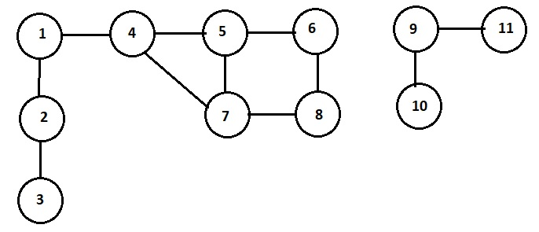
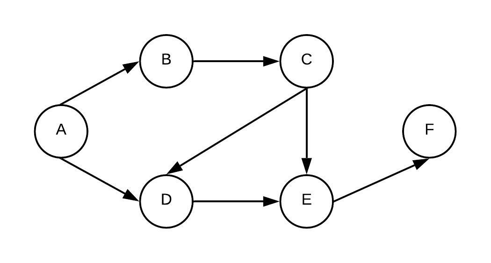
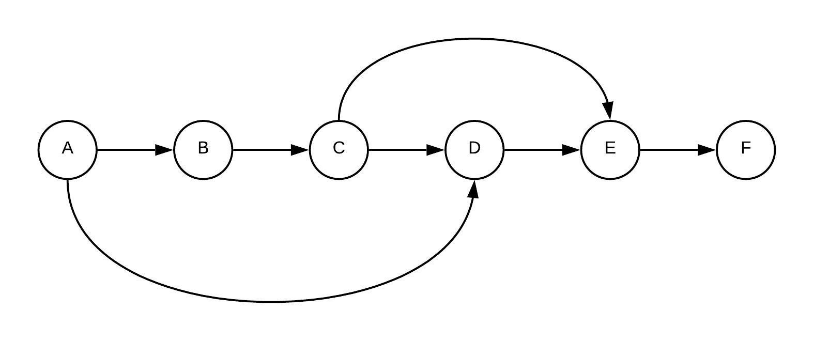

# Graphs

A graph, **G = (V, E)**, is a data structure that consists of **V** vertices and **E** edges.
An edge connects two vertices and is represented by a pair of the two vertices it connects, (*v<sub>1</sub>*, *v<sub>2</sub>*).
A graph could be:
* **directed**, also called **digraph**, with a sense of direction, where an edge is an ordered pair (*v<sub>1</sub>*, *v<sub>2</sub>*),
* **undirected** where an edge is an unordered pair (*v<sub>1</sub>*, *v<sub>2</sub>*) and (*v<sub>2</sub>*, *v<sub>1</sub>*).



## Graph representation
* Adjacency matrix *undirected*
```
    1  2  3  4  5  6  7  8  9 10 11
1   0  1  0  1  0  0  0  0  0  0  0
2   1  0  1  0  0  0  0  0  0  0  0  
3   0  1  0  0  0  0  0  0  0  0  0
4   1  0  0  0  1  0  1  0  0  0  0
5   0  0  0  1  0  1  1  0  0  0  0
6   0  0  0  0  1  0  0  1  0  0  0
7   0  0  0  1  1  0  0  1  0  0  0
8   0  0  0  0  0  1  1  0  0  0  0
9   0  0  0  0  0  0  0  0  0  1  1
10  0  0  0  0  0  0  0  0  1  0  0
11  0  0  0  0  0  0  0  0  1  0  0
```
* Adjacency list *undirected*
```
1  -> 2, 4
2  -> 1, 3
3  -> 2
4  -> 1, 5, 7
5  -> 4, 6, 7
6  -> 5, 8
7  -> 4, 5, 8 
8  -> 6, 7
9  -> 10, 11
10 -> 9
11 -> 9
```
Adjancency list is the most common representation used for graph. Here is a possible C++ implementation:
```C++
/*
 * Graph implementation.
 */
template<typename T>
class graph
{
private:
	struct vertex
	{
		T           vrtx;       // vertex
		vector<T>   adjacent;   // adjacent vertices

		explicit vertex(T v) : vrtx(v) {}
		bool operator==(T v) const { return (this->vrtx == v); }
	};

	bool            directed;       // directed or undirected?
	size_t          count;          // number of vertices
	vector<vertex>  vertices;       // vertices in the graph

	/*
	 * Get a vertex, v. The const version.
	 * Throws out_of_range exception if the vertex is not found.
	 */
	const vertex & get_vertex(T v) const
	{
		typename vector<vertex>::const_iterator it = find(vertices.begin(), vertices.end(), v);
		if (it == vertices.end()) {
			ostringstream oss;
			oss << "vertex " << v << " not found";
			throw out_of_range(oss.str());
		} else {
			return *it;
		}
	}

	/*
	 * Get a vertex, v.
	 * Throws out_of_range exception if the vertex is not found.
	 */
	vertex & get_vertex(T v)
	{
		typename vector<vertex>::iterator it = find(vertices.begin(), vertices.end(), v);
		if (it == vertices.end()) {
			ostringstream oss;
			oss << "vertex " << v << " not found";
			throw out_of_range(oss.str());
		} else {
			return *it;
		}
	}

	/*
	 * Add an edge (from, to).
	 */
	void add_edge(vertex &from, const vertex &to)
	{
		if (from.adjacent.end() == find(from.adjacent.begin(), from.adjacent.end(), to.vrtx))
			from.adjacent.push_back(to.vrtx);
	}

public:
	graph(bool dir = true) : directed(dir), count(0) {}

	/*
	 * Add a vertex, v.
	 */
	void add_vertex(T v)
	{
		typename vector<vertex>::iterator it = find(vertices.begin(), vertices.end(), v);
		if (it == vertices.end()) {
			vertices.emplace_back(v);
			++count;
		}
	}

	/*
	 * Add an edge, (from, to). If the graph is undirected, edge (to, from)
	 * is added as well.
	 */
	void add_edge(T from, T to)
	{
		add_vertex(from);
		add_vertex(to);

		vertex &v1 = get_vertex(from);
		vertex &v2 = get_vertex(to);

		add_edge(v1, v2);
		if (!directed)
			add_edge(v2, v1);
	}

	size_t num_vertices() const { return count; }

	/*
	 * Prints the graph on the screen.
	 */
	void dump()
	{
		cout << "Number of vertices: " << count << endl;

		for (auto v : vertices) {
			cout << v.vrtx;

			if (!v.adjacent.empty())
				cout << " -> ";

			for (auto adj : v.adjacent) 
				cout << adj << " ";

			cout << endl;
		}
	}
};
```

## Degree of a vertex
The number of edges coming out of a vertex is the degree of that edge.
```C++
	// Part of graph class

	/*
	 * Find the degree of an vertex, v.
	 */
	size_t degree(T v) const
	{
		return get_vertex(v).adjacent.size();
	}
```

## Graph Traversal
There are two main graph traversal methods based on the order in which the vertices are visited:
* **Depth First Search (DFS)** A very popular approach suitable to recursion. An arbitrary vertex is chosen. The action needed on the vertex is performed and the vertex is marked as *visited*. Then an adjacent, unvisited, vertex is picked up arbitrarily. The action needed is performed and that vertex is marked as *visited* as well. The process continues, as we go deeper into the graph, until all the connected vertices are processed and marked as *visited*. The data structure used to save the *unexplored* vertices is stack and that makes it apt for recursion.
* **Breadth First Search (BFS)** An organized approach were vertices are visited level by level. An arbitrary vertex is chosen. The action needed on the vertex is performed and the vertex is marked as *visited*. Next all adjacent, unvisited, vertices are processed and marked as *visited*. The process continues until all the vertices at all levels are processed and marked as *visited*. The data structure used to save the *unexplored* vertices is queue. BFS gives the **shortest path** between any two vertices of the graph.
```C++
/*
 * Sample visitor function type.
 */
template<typename T>
using visitor_t = void(*)(T);

/*
 * Sample visitor function definition.
 * The visitor simply prints the vertex.
 */
template<typename T>
void visitor(T v)
{
	cout << v << endl;
}

	// Part of graph class

	/*
	 * Depth first traversal starting from vertex *from*.
	 * @param visited maintains a set of vertices that are already visited.
	 * @param visitor performs processing at the each vertex.
	 * @param from    starting vertex.
	 */
	void depth_first_traversal(set<T> &visited, visitor_t<T> visitor, const vertex &from)
	{
		if (visited.end() != visited.find(from.vrtx))
			return;

		/*
		 * Not visited yet.
		 * Process and mark as visited.
		 */
		(*visitor)(from.vrtx);
		visited.insert(from.vrtx);

		/*
		 * Dive deeper.
		 */
		typename vector<T>::const_iterator it;
		for (it = from.adjacent.begin(); it != from.adjacent.end(); ++it)
			depth_first_traversal(visited, visitor, get_vertex(*it));
	}

	/*
	 * Depth first traversal for the whole graph.
	 * @param visited maintains a set of vertices that are already visited.
	 * @param visitor performs processing at the each vertex.
	 */
	void depth_first_traversal(set<T> &visited, visitor_t<T> visitor)
	{
		/*
		 * Do DFS for each vertex.
		 */
		typename vector<vertex>::const_iterator it;
		for (it = vertices.begin(); it != vertices.end(); ++it)
			depth_first_traversal(visited, visitor, *it);
	}

	/*
	 * Breadth first traversal starting from vertex *from*.
	 * @param visited maintains a set of vertices that are already visited.
	 * @param visitor performs processing at the each vertex.
	 * @param from    starting vertex.
	 */
	void breadth_first_traversal(set<T> &visited, visitor_t<T> visitor, T from)
	{
		queue<T> q;

		q.push(from);

		while (!q.empty()) {
			from = q.front();
			q.pop();

			if (visited.end() == visited.find(from)) {
				/*
				 * Not visited yet.
				 * Process and mark as visited.
				 */
				(*visitor)(from);
				visited.insert(from);

				vertex &v = get_vertex(from);

				/*
				 * Now add all the adjacent ones to the queue.
				 */
				typename vector<T>::const_iterator it;
				for (it = v.adjacent.begin(); it != v.adjacent.end(); ++it)
					q.push(*it);
			}
		}
	}

	/*
	 * Breadth first traversal for the whole graph.
	 * @param visited maintains a set of vertices that are already visited.
	 * @param visitor performs processing at the each vertex.
	 */
	void breadth_first_traversal(set<T> &visited, visitor_t<T> visitor)
	{
		/*
		 * Do BFS for each vertex.
		 */
		typename vector<vertex>::const_iterator it;
		for (it = vertices.begin(); it != vertices.end(); ++it)
			breadth_first_traversal(visited, visitor, it->vrtx);
	}

	enum class traversal_order
	{
		depth_first,
		breadth_first
	};

	/*
	 * Traverse the graph based on the traveral order requested
	 * and applying visitor at each vertex.
	 */
	void traverse(traversal_order order, visitor_t<T> visitor)
	{
		set<T> visited;
		if (order == traversal_order::depth_first)
			depth_first_traversal(visited, visitor);
		else if (order == traversal_order::breadth_first)
			breadth_first_traversal(visited, visitor);
	}
```
## Traversal Problem 1
*Problem:* Given a graph with vertices v<sub>1</sub>, v<sub>2</sub>, v<sub>3</sub>, ..., v<sub>n - 1</sub>, v<sub>n</sub>, does a path exists between vertex v<sub>source</sub> and v<sub>target</sub>?<br>
*Solution:* Perform DFS traversal starting from vertex v<sub>source</sub>. If we encounter v<sub>target</sub>, then a path exists. If the DFS traversal completes without finding v<sub>target</sub>, then no path exists between them.
```C++
	// Part of graph class

	/*
	 * Determine if a path exists between two vertices.
	 * We are essentially doing depth first search starting from source
	 * until we find target.
	 *
	 * @param visited maintains a set of vertices that are already visited.
	 * @param source  source vertex.
	 * @param target  target vertex.
	 * @return true if a path exists, false otherwise.
	 */
	bool path_exists(set<T> &visited, const vertex &source, T target)
	{
		if (visited.end() != visited.find(source.vrtx))
			return false;

		/*
		 * Not visited yet. Mark as visited.
		 */
		visited.insert(source.vrtx);

		/*
		 * Short-cut: See if we have reached the target vertex.
		 * This check could well be in the loop below as well.
		 * See the commented code in the loop below.
		 */
		typename vector<T>::const_iterator it = find(source.adjacent.begin(), source.adjacent.end(), target);
		if (it != source.adjacent.end())
			return true;

		/*
		 * Dive deeper looking for target.
		 */
		for (it = source.adjacent.begin(); it != source.adjacent.end(); ++it) {
			/*
			 * if (it->vrtx == target)
			 *     return true;
			 */
			if (path_exists(visited, get_vertex(*it), target))
				return true;
		}

		return false;
	}

	/*
	 * Determine if a path exists between two vertices.
	 * @param source source vertex.
	 * @param target target vertex.
	 * @return true if a path exists, false otherwise.
	 */
	bool path_exists(T source, T target)
	{
		set<T> visited;
		return path_exists(visited, get_vertex(source), target);
	}
```
## Traversal Problem 2
*Problem:* Given a graph with vertices v<sub>1</sub>, v<sub>2</sub>, v<sub>3</sub>, ..., v<sub>n - 1</sub>, v<sub>n</sub>, find all paths between vertex v<sub>source</sub> and v<sub>target</sub>?<br>
*Solution:* Perform DFS traversal starting from vertex v<sub>source</sub>. Keep recording the paths until we reach the vertex v<sub>target</sub>. We must also mark the vertex as visited as we proceed. This is to avoid cycles, especially for undirected graphs. This is yet another example of **backtracking** problem.
```C++
	// Part of graph class

	/*
	 * Get all paths between two vertices.
	 * @param paths  maintains paths already visited.
	 * @param visited maintains a set of vertices that are already visited.
	 * @param source source vertex.
	 * @param target target vertex.
	 */
	void get_paths(vector<T> &paths, set<T> &visited, const vertex &from, T to)
	{
		/*
		 * Mark the path as visited.
		 * Add the vertex to the set of path list.
		 */
		visited.insert(from.vrtx);
		paths.push_back(from.vrtx);

		typename vector<T>::const_iterator it = find(from.adjacent.begin(), from.adjacent.end(), to);
		if (it != from.adjacent.end()) {
			/*
			 * We have reached the target vertex, print the paths.
			 */
			cout << "path: ";
			for (auto v : paths)
				cout << v << " ";
			cout << to << endl;
		} else {
			/*
			 * Dive deeper.
			 */
			for (it = from.adjacent.begin(); it != from.adjacent.end(); ++it) {
				if (visited.end() == visited.find(*it)) {
					get_paths(paths, visited, get_vertex(*it), to);
				}
			}
		}

		/*
		 * Remove the vertex from path list.
		 * Unmark the path as visited.
		 */
		paths.pop_back();
		visited.erase(from.vrtx);
	}

	/*
	 * Get all paths between two vertices.
	 * @param source source vertex.
	 * @param target target vertex.
	 */
	void get_paths(T source, T target)
	{
		vector<T> paths;
		set<T> visited;
		get_paths(paths, visited, get_vertex(source), target);
	}
``` 
## Traversal Problem 3
*Problem:* Given a graph with vertices v<sub>1</sub>, v<sub>2</sub>, v<sub>3</sub>, ..., v<sub>n - 1</sub>, v<sub>n</sub>, find if there is a cycle in the graph.<br>
*Solution:* Perform DFS traversal. Along with keeping track of vertices that have already been visited, maintain a hierarchy table. The table has two columns:
* current vertex
* vertex from where the current vertex is visited or simply the parent vertex.

Before inserting the relationship, check if the vertex already exists in the hierarchy table. If it does there is a loop. However there is a special case to be handled here. It is the **backedge** in case of **undirected** graph. We do not want to count (*v<sub>1</sub> -> v<sub>2</sub>*) and (*v<sub>2</sub> -> v<sub>1</sub>*) as a loop. Accounting all these considerations, we have the following algorithm:
```C++
	// Part of graph class.

	/*
	 * Is there a cycle in the graph?
	 *
	 * @param hierarchy maintains a (vertex -> parent vertex) map.
	 * @param visited   maintains a set of vertices that are already visited.
	 * @param v         vertex being visited.
	 * @param parent    parent vertex. -1 if there is no parent.
	 *
	 * @return true if there is a cycle and false otherwise.
	 * If there is a loop, the vertices in the loop are printed as well.
	 */
	bool is_cyclic(map<T, T> &hierarchy, set<T> &visited, T v, T parent)
	{
		if (hierarchy.end() == hierarchy.find(v)) {
			/*
			 * Not in hierarchy at all; add the relationship.
			 */
			hierarchy[v] = parent;
		} else {
			/*
			 * Already in hierarchy. Check if it is a back-edge.
			 * Hierarchy table for graph 1 <--> 2
			 * vertex | parent
			 *   1    |  -1
			 *   2    |   1
			 * This function is called with v = 1, parent = 2.
			 */
			typename map<T, T>::const_iterator it = hierarchy.find(parent);
			if (it != hierarchy.end()) {
				if (it->second == v) {
					/*
					 * It is a back-edge. Ignore it.
					 */
					return false;
				} else {
					/*
					 * Print the cycle and return true.
					 */
					cout << v << " " << parent << " ";
					while (it != hierarchy.end()) {
						cout << it->second << " ";
						it = hierarchy.find(it->second);
						if (it->first == v)
							break;
					}
					cout << endl;
					return true;
				}
			}
		}

		if (visited.end() == visited.find(v)) {
			/*
			 * Not visited yet; mark as visited.
			 */
			visited.insert(v);

			/*
			 * Dive deeper.
			 */
			const vertex &V = get_vertex(v);
			typename vector<T>::const_iterator it;
			for (it = V.adjacent.begin(); it != V.adjacent.end(); ++it) {
				if (is_cyclic(hierarchy, visited, *it, v))
					return true;
			}
		}

		/* Backtrack */
		hierarchy.erase(v);
		return false;
	}

	/*
	 * Is there a cycle in the graph?
	 * @param parent parent vertex if the first vertex usually -1 for T = int.
	 */
	bool is_cyclic(T parent)
	{
		map<T, T> hierarchy;
		set<T> visited;

		typename vector<vertex>::const_iterator it;
		for (it = vertices.begin(); it != vertices.end(); ++it) {
			if (is_cyclic(hierarchy, visited, it->vrtx, parent))
				return true;
		}

		return false;
	}
```

## Directed Acyclic Graph (DAG)
DAG is a directed graph with no cycles in it.
```C++
	// Part of graph class

	/*
	 * Is the graph a directed acyclic graph?
	 * @param parent parent vertex if the first vertex usually -1 for T = int.
	 */
	bool is_dag(T parent)
	{
		if (!directed)
			return false;
		return !is_cyclic(parent);
	}
```

## Topological Sorting
Suppose we have *n* jobs at hand with the following constraints:
* There are only finite number of jobs (which means there is a sink or, in other words, there is at least one job with no dependent job).
* Only one job can be performed at a time.
* Certain jobs depend on other jobs. They can only be started when the dependent tasks are done.

The algorith to generate a schedule is called **topological sorting**. Some examples of use in real life are:
* Designing the assembly line for a component in a manufacturing division.
* Generating the classroom schedule.

The problem can be formulated as a **DAG** where each job represents a vertex and the job dependencies are represented by edges. Let's take an example. There are 6 courses (*A, B, C, D, E, F*) to be taken to get a certain certification. However for many courses there is one or more dependent courses (the dependent courses must be completed before taking a course).

Course | Dependent Course
-------|-----------------
A      | -
B      | A
C      | B
D      | A, C
E      | C, D
F      | E

This can be represented as the following DAG with A as the source (no dependency) and E as the sink (no outedge).


Alternative this could also be represented in a straight-line as following:


As can been seen, A has indegree of 0. It is not dependent on any course. A is our **source**. F has outdegree of 0. It is our **sink**. The algorithm for topological sorting involves finding the vertex with indegree of 0 and removing the vertex and the outgoing edges. Put this in a queue. Repeat the process until we are left with no more vertices. Let's see how this applies to our case.
* A has indegree of 0. Remove A. Add A to a queue. Q = A.
* Now B has indegree of 0. Remove B. Add B to the queue. Q = A B.
* C now has indegree of 0. Remove C. Add C to the queue. Q = A B C.
* D now has indegree of 0. Remove D. Add D to the queue. Q = A B C D.
* E now has indegree of 0. Remove E. Add E to the queue. Q = A B C D E.
* We are left with just F which too has indegree of 0. Remove F. Add F to the queue. Q = A B C D E F.

The algorithm involves:
* Calculating the indegree of all the vertices. This can be done with **DFS**.
* Removing vertex with indegree of 0. This also mean updating the indegree of vertices adjacent to the removed vertex.
* Putting the removed vertex in a queue.

There is an alternate approach to get the same result. Perform **DFS**. When you are returning from the last vertex (*sink*), add it to a stack. The stack holds the results of topological sorting in reversed order. When you pop the vertices from the stack, you get the correct order.
```C++
	// Part of graph class.

	/*
	 * Perform topological sorting.
	 *
	 * @param stk toplogical sorted vertex on return.
	 * @param visited maintains a set of vertices that are already visited.
	 * @param from    starting vertex.
	 */
	void topological_sort(stack<T> &stk, set<T> &visited, const vertex &from)
	{
		if (visited.end() != visited.find(from.vrtx))
			return;

		/*
		 * Not visited yet; mark as visited.
		 */
		visited.insert(from.vrtx);

		/*
		 * Dive deeper.
		 */
		typename vector<T>::const_iterator it;
		for (it = from.adjacent.begin(); it != from.adjacent.end(); ++it)
			topological_sort(stk, visited, get_vertex(*it));

		/*
		 * Add the vertex to the stack.
		 */
		stk.push(from.vrtx);
	}

	/*
	 * Perform topological sorting.
	 * @param stk toplogical sorted vertex on return.
	 */
	void topological_sort(stack<T> &stk)
	{
		set<T> visited;

		typename vector<vertex>::const_iterator it;
		for (it = vertices.begin(); it != vertices.end(); ++it) {
			topological_sort(stk, visited, *it);
		}
	}
```
