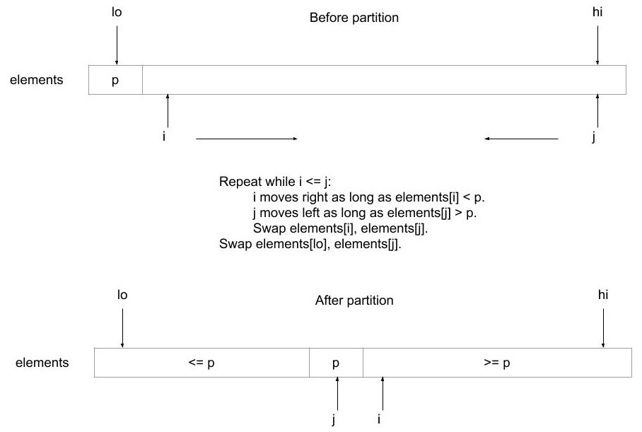

# Sorting

## Stable Sort
A **stable** sort preserves the original ordering of identical items.

```
Input     : [(a, 10), (b, 7), (c, 8), (d, 7), (e, 6), (f, 10), (g, 3)]
Operation : Sort by the second numeric field.
Output    : [(g, 3), (e, 6), (b, 7), (d, 7), (c, 8), (a, 10), (f, 10)]
```

The stablity property of the sorting algorith guarantees that the relative ordering of [(b, 7), (d, 7)] and [(a, 10), (f, 10)] is preserved. Note (b, 7) appears before (d, 7) both in the input and the output. Similarly (a, 10) appears before (f, 10) in both the input and the output.

## Radix Sort

Input: Sequence of *n* items, each item with *w* digits. Each digit is in the range *0 - m*.

Radix sort is often used when the keys to sort are small strings. Let's see a sample input set:

```
Input: ram, mad, she, him, the, cat, car, bar, sky, all
n - 10, there are 10 items to sort.
w - 3, each item has 3 digits.
m - 255, each digit can have values in the range 0 - 255.
```

## LSD Radix Sort (Straight Radix Sort)
The digits of items are scanned from the least significant digit (LSD) to the most significant digit (MSD).
```
input : ram, mad, she, him, the, cat, car, bar, sky, all
w = 3 : mad, she, the, all, ram, him, car, bar, cat, sky
w = 2 : mad, ram, car, bar, cat, she, the, him, sky, all
w = 1 : all, bar, car, cat, him, mad, ram, she, sky, the
output: all, bar, car, cat, him, mad, ram, she, sky, the
```

This is a stable sort and complexity is *nw*.

This works great for strings of equal length. What to do for strings of variable lengths? We can assume that the all strings are as long as the longest string in the input and return 0 for the overflowing w.

```C++
/*
 * Get the character at the specified index in the
 * given string.
 *
 * @param [in] s - the given string.
 * @param [in] i - the given index.
 *
 * @return character at the specified index in the string.
 * If the index is beyond the string length, return 0.
 */
static int
char_at(const std::string &s, size_t i)
{
	return (i < s.length()) ? s[i] : 0;
}
```

### Implementation using queues.
```C++
/*
 * LSD radix sort. This is a straight-forward  implementation
 * using:
 * - 1 main queue, initialized with input items.
 * - 256 auxiliary queues, one for every possible character [0-255].
 *
 * @param [inout] elements  - the vector to sort.
 * @paran [in]    max_width - the maximum size of string across
 *                            all elements of the vector.
 *
 * @return elements is sorted on return.
 */
void
lsd_radix_sort_v1(vector<string> &elements, size_t max_width)
{
	constexpr int N = 256;
	queue<string> mainq;

	/*
	 * 256 auxiliary queues: one for each valid character.
	 */
	array<queue<string>, N> auxq;

	/*
	 * Move all the strings to the main queue.
	 * This queue is processed (sorted) at every valid
	 * index position.
	 */
	for (auto e : elements)
		mainq.push(e);
	elements.clear();

	/*
	 * Repeat max_width times from least significant digit
	 * (LSD) to most significant digit (MSD) sorting strings
	 * based on the character at index w - 1.
	 */
	for (size_t w = max_width; w > 0; --w) {
		/*
		 * Read the strings from the main queue and
		 * push the strings in the correct queue.
		 */
		while (!mainq.empty()) {
			string s = mainq.front();
			mainq.pop();
			auxq[char_at(s, w - 1)].push(s);
		}

		/*
		 * Copy the strings back from auxiliary queues
		 * to the main queue.
		 */
		for (size_t j = 0; j < N; ++j) {
			while (!auxq[j].empty()) {
				mainq.push(auxq[j].front());
				auxq[j].pop();
			}
		}

#if defined(DEBUG)
		cout << "w = " << w << " : " << mainq << endl;
#endif // DEBUG
	}

	/*
	 * The main queue is sorted now!
	 * Copy the strings from the main queue back to the
	 * vector.
	 */
	while (!mainq.empty()) {
		elements.push_back(mainq.front());
		mainq.pop();
	}

	return;
}
```

### Implementation using key index counting sort.
LSD radix sort using queues is simple to understand and easy to implement. However, it needs a lot of additional space. Can we do better? In the following counting sort approach, we use an integer array of size (256 + 1). As before, we scan from LSD to MSD. Instead of adding strings to the queue, we increment the corresponding array element count.
```
input    : ram, mad, she, him, the, cat, car, bar, sky, all
i        :  0 a b c d e f g h i j k l m n o p q r s t u v w x y z
count[i] :  0 0 0 0 0 1 2 0 0 0 0 0 0 1 2 0 0 0 0 2 0 1 0 0 0 0 1
```
Please note that instead of incrementing *count[N]*, *count[N + 1]* is incremented. There is a trick involved here. Next, we generate a cumulative count.
```
input    : ram, mad, she, him, the, cat, car, bar, sky, all
i        :  0 a b c d e f g h i j k l m n o p q r s t u v w x y z
count[i] :  0 0 0 0 0 1 3 3 3 3 3 3 3 4 6 6 6 6 6 8 8 9 9 9 9 9 10
```
Now *count[N]* gives us the index where the item should go into the sorted sequence. And *count[N]* must be incremented after copying the item. Here is a complete implementation:
```C++
/*
 * LSD radix sort. The sort uses key index count sorting.
 *
 * @param [inout] elements  - the vector to sort.
 * @paran [in]    max_width - the maximum size of string across
 *                            all elements of the vector.
 *
 * @return elements is sorted on return.
 */
void
lsd_radix_sort_v2(vector<string> &elements, size_t max_width)
{
	constexpr int N = 256;
	vector<string> aux;         // auxiliary vector of strings
	array<int, N + 1> count;    // count of valid characters: one for each character.

	/*
	 * Repeat max_width times from least significant digit
	 * (LSD) to most significant digit (MSD) sorting strings
	 * based on the character at index w - 1.
	 */
	for (size_t w = max_width; w > 0; --w) {
		// character index we are dealing with.
		int idx = w - 1;

		// copy all elements to the auxiliary vector.
		for (auto e : elements)
			aux.push_back(e);

		// initialize all the counters to 0.
		for (size_t c = 0; c <= N; ++c)
			count[c] = 0;

		/*
		 * Set the count of each character. There is a trick here.
		 * Instead of setting the count[char_at(a, idx)], it sets
		 * count[char_at(a, idx) + 1].
		 */
		for (auto a : aux)
			count[char_at(a, idx) + 1]++;

		// Calculated the cumulative count.
		for (size_t c = 0; c <= N; ++c)
			count[c + 1] += count[c];

		/*
		 * Now count[char_at(a, idx)] represents the index where the
		 * string should be copied into the main vector. count[char_at(a, idx)]
		 * is incremented to represent the next index in case the character
		 * is seen again.
		 */
		for (auto a : aux)
			elements[count[char_at(a, idx)]++] = a;

		aux.clear();

#if defined(DEBUG)
		cout << "w = " << w << " : " << elements << endl;
#endif // DEBUG
	}

	return;
}
```

## MSD Radix Sort (Radix Exchange Sort)
The digits of items are scanned from the least significant digit (LSD) to the most significant digit (MSD).
```
input : ram, mad, she, him, the, cat, car, bar, sky, all
w = 1, lo = 0, hi = 10 : all, bar, cat, car, him, mad, ram, she, sky, the
w = 2, lo = 2, hi = 4 : -, -, cat, car, -, -, -, -, -, -
w = 3, lo = 2, hi = 4 : -, -, car, cat, -, -, -, -, -, -
w = 2, lo = 7, hi = 9 : -, -, -, -, -, -, -, she, sky, -
output: all, bar, car, cat, him, mad, ram, she, sky, the
```
The algorithm implementation is recursive and messy. The complexity is between *n* and *nw* or *n(1 + w) / 2*.
```C++
/*
 * MSD radix sort. The sort uses key index count sorting.
 *
 * @param [inout] elements  - the vector to sort.
 * @param [in]    aux       - an auxiliary vector.
 * @param [in]    lo        - process elements starting from lo index.
 * @param [in]    hi        - process elements upto hi index (non inclusive).
 * @param [in]    w         - position at which the character is to be processed.
 * @paran [in]    max_width - the maximum size of string across
 *                            all elements of the vector.
 * @return elements is sorted on return.
 */
static void
msd_radix_sort(vector<string> &elements, vector<string> &aux, size_t lo, size_t hi, size_t w, size_t max_width)
{
	constexpr int N = 256;
	array<int, N + 1> count;    // count of valid characters: one for each character <== trick
	array<int, N> count2;       // count of valid characters: one for each character <== no trick

	// have we scanned all the elements
	if (w == max_width)
		return;

	// check if there is no elements or a single element to process.
	if ((lo == hi) || ((lo + 1) == hi))
		return;

	// copy all elements to the auxiliary vector.
	for (size_t i = lo; i < hi; ++i)
		aux.push_back(elements[i]);

	// initialize all the counters to 0.
	for (size_t c = 0; c <= N; ++c)
		count[c] = 0;

	for (size_t c = 0; c < N; ++c)
		count2[c] = 0;

	/*
	 * Set the count of each character. There is a trick here.
	 * Instead of setting the count[char_at(a, idx)], it sets
	 * count[char_at(a, idx) + 1].
	 */
	for (auto a : aux) {
		int idx = char_at(a, w);
		count[idx + 1]++;   // trick
		count2[idx]++;      // no-trick
	}

	// set the cumulative count.
	for (size_t c = 0; c < N; ++c)
		count[c + 1] += count[c];

	/*
	 * Now lo + count[char_at(a, idx)] represents the index where the
	 * string should be copied in the main vector. count[char_at(a, idx)]
	 * is incremented to represent the next index in case the character
	 * is seen again.
	 */
	for (auto a : aux)
		elements[lo + count[char_at(a, w)]++] = a;

	aux.clear();

#if defined(DEBUG)
	cout << "w = " << w + 1 << ", lo = " << lo << ", hi = " << hi << " : ";
	for (size_t i = 0; i < elements.size(); ++i) {
		if (i != 0)
			cout << ", ";
		if ((i < lo) || (i >= hi))
			cout << "-";
		else
			cout << elements[i];
	}
	cout << endl;
#endif // DEBUG

	/*
	 * The elements are now sorted based on character at position w.
	 * Dive deep to sort elements at character position w + 1.
	 * count2 tells us how many string to process.
	 */
	while (lo < hi) {
		int num_of_elem = count2[char_at(elements[lo], w)];
		msd_radix_sort(elements, aux, lo, lo + num_of_elem, w + 1, max_width);
		lo += num_of_elem;
	}

	return;
}

/*
 * MSD radix sort.
 *
 * @param [inout] elements  - the vector to sort.
 * @paran [in]    max_width - the maximum size of string across
 *                            all elements of the vector.
 *
 * @return elements is sorted on return.
 */
void
msd_radix_sort(vector<string> &elements, size_t max_width)
{
	vector<string> aux;     // auxiliary vector of strings
	msd_radix_sort(elements, aux, 0, elements.size(), 0, max_width);
}
```

## Bubble Sort
Steps through the input sequence, compares two adjacent elements, and swaps them if they are in wrong order. When sorting the sequence in ascending order, the biggest items bubbles to the top of the sequence.
```C++
/*
 * Perform bubble sort.
 *
 * @param [inout] elements  - the vector to sort.
 *
 * @return elements are sorted on return.
 */
template<typename T>
void
bubble_sort(vector<T> &elements)
{
	size_t length = elements.size();
	size_t ncmp;
	size_t nswap;

	for (size_t i = 0; i < length - 1; ++i) {
		ncmp = 0;
		nswap = 0;

		for (size_t j = 0; j < length - i - 1; ++j) {
			ncmp++;
			if (elements[j] > elements[j + 1]) {
				nswap++;
				swap(elements[j], elements[j + 1]);
			}
		}

		print_stats(i + 1, ncmp, nswap, elements);
	}
}
```

### Bubble sort statistics
Sequence already sorted:
```
input : 0, 1, 2, 3, 4, 5, 6, 7, 8, 9
iteration =  1 ( 0, 1, 2, 3, 4, 5, 6, 7, 8, 9 ) comparisons =  9, swap =  0
iteration =  2 ( 0, 1, 2, 3, 4, 5, 6, 7, 8, 9 ) comparisons =  8, swap =  0
iteration =  3 ( 0, 1, 2, 3, 4, 5, 6, 7, 8, 9 ) comparisons =  7, swap =  0
iteration =  4 ( 0, 1, 2, 3, 4, 5, 6, 7, 8, 9 ) comparisons =  6, swap =  0
iteration =  5 ( 0, 1, 2, 3, 4, 5, 6, 7, 8, 9 ) comparisons =  5, swap =  0
iteration =  6 ( 0, 1, 2, 3, 4, 5, 6, 7, 8, 9 ) comparisons =  4, swap =  0
iteration =  7 ( 0, 1, 2, 3, 4, 5, 6, 7, 8, 9 ) comparisons =  3, swap =  0
iteration =  8 ( 0, 1, 2, 3, 4, 5, 6, 7, 8, 9 ) comparisons =  2, swap =  0
iteration =  9 ( 0, 1, 2, 3, 4, 5, 6, 7, 8, 9 ) comparisons =  1, swap =  0
output: 0, 1, 2, 3, 4, 5, 6, 7, 8, 9
```
Sequence in completely reverse order:
```
input : 9, 8, 7, 6, 5, 4, 3, 2, 1, 0
iteration =  1 ( 8, 7, 6, 5, 4, 3, 2, 1, 0, 9 ) comparisons =  9, swap =  9
iteration =  2 ( 7, 6, 5, 4, 3, 2, 1, 0, 8, 9 ) comparisons =  8, swap =  8
iteration =  3 ( 6, 5, 4, 3, 2, 1, 0, 7, 8, 9 ) comparisons =  7, swap =  7
iteration =  4 ( 5, 4, 3, 2, 1, 0, 6, 7, 8, 9 ) comparisons =  6, swap =  6
iteration =  5 ( 4, 3, 2, 1, 0, 5, 6, 7, 8, 9 ) comparisons =  5, swap =  5
iteration =  6 ( 3, 2, 1, 0, 4, 5, 6, 7, 8, 9 ) comparisons =  4, swap =  4
iteration =  7 ( 2, 1, 0, 3, 4, 5, 6, 7, 8, 9 ) comparisons =  3, swap =  3
iteration =  8 ( 1, 0, 2, 3, 4, 5, 6, 7, 8, 9 ) comparisons =  2, swap =  2
iteration =  9 ( 0, 1, 2, 3, 4, 5, 6, 7, 8, 9 ) comparisons =  1, swap =  1
output: 0, 1, 2, 3, 4, 5, 6, 7, 8, 9
```
Sequence with random distribution:
```
input : 0, 9, 7, 2, 4, 6, 5, 8, 1, 3
iteration =  1 ( 0, 7, 2, 4, 6, 5, 8, 1, 3, 9 ) comparisons =  9, swap =  8
iteration =  2 ( 0, 2, 4, 6, 5, 7, 1, 3, 8, 9 ) comparisons =  8, swap =  6
iteration =  3 ( 0, 2, 4, 5, 6, 1, 3, 7, 8, 9 ) comparisons =  7, swap =  3
iteration =  4 ( 0, 2, 4, 5, 1, 3, 6, 7, 8, 9 ) comparisons =  6, swap =  2
iteration =  5 ( 0, 2, 4, 1, 3, 5, 6, 7, 8, 9 ) comparisons =  5, swap =  2
iteration =  6 ( 0, 2, 1, 3, 4, 5, 6, 7, 8, 9 ) comparisons =  4, swap =  2
iteration =  7 ( 0, 1, 2, 3, 4, 5, 6, 7, 8, 9 ) comparisons =  3, swap =  1
iteration =  8 ( 0, 1, 2, 3, 4, 5, 6, 7, 8, 9 ) comparisons =  2, swap =  0
iteration =  9 ( 0, 1, 2, 3, 4, 5, 6, 7, 8, 9 ) comparisons =  1, swap =  0
output: 0, 1, 2, 3, 4, 5, 6, 7, 8, 9
```
As can be seen the number of comparisons in all the cases are *n * (n - 1) / 2*. The number of swaps are 0 if the sequence is already sorted, *n * (n - 1) / 2* if the sequence is reverse sorted, and *n * (n - 1) / 4* if the sequence is initially randomly distributed. Bubble sort is stable and complexity of the algorith is *n * n* for both comparisons and swaps.

## Selection Sort
Find the smallest element in the sequence and swap it with the first element. Item 1 in the sequence is in its final place. Find the next smallest element and replace it with the second element. Item 2 in the sequence is ints final place. Repeat until the whole sequence is sorted.
```C++
/*
 * Perform selection sort.
 *
 * @param [inout] elements  - the vector to sort.
 *
 * @return elements are sorted on return.
 */
template<typename T>
void
selection_sort(vector<T> &elements)
{
	size_t ncmp;
	size_t nswap;

	for (size_t i = 0; i < elements.size() - 1; ++i) {
		size_t min_idx = i;

		ncmp = 0;
		nswap = 0;

		for (size_t j = i + 1; j < elements.size(); ++j) {
			ncmp++;
			if (elements[j] < elements[min_idx]) {
				min_idx = j;
			}
		}

		if (min_idx != i) {
			nswap++;
			swap(elements[i], elements[min_idx]);
		}

		print_stats(i + 1, ncmp, nswap, elements);
	}
}
```

### Selection sort statistics
Sequence already sorted:
```
input : 0, 1, 2, 3, 4, 5, 6, 7, 8, 9
iteration =  1 ( 0, 1, 2, 3, 4, 5, 6, 7, 8, 9 ) comparisons =  9, swap =  0
iteration =  2 ( 0, 1, 2, 3, 4, 5, 6, 7, 8, 9 ) comparisons =  8, swap =  0
iteration =  3 ( 0, 1, 2, 3, 4, 5, 6, 7, 8, 9 ) comparisons =  7, swap =  0
iteration =  4 ( 0, 1, 2, 3, 4, 5, 6, 7, 8, 9 ) comparisons =  6, swap =  0
iteration =  5 ( 0, 1, 2, 3, 4, 5, 6, 7, 8, 9 ) comparisons =  5, swap =  0
iteration =  6 ( 0, 1, 2, 3, 4, 5, 6, 7, 8, 9 ) comparisons =  4, swap =  0
iteration =  7 ( 0, 1, 2, 3, 4, 5, 6, 7, 8, 9 ) comparisons =  3, swap =  0
iteration =  8 ( 0, 1, 2, 3, 4, 5, 6, 7, 8, 9 ) comparisons =  2, swap =  0
iteration =  9 ( 0, 1, 2, 3, 4, 5, 6, 7, 8, 9 ) comparisons =  1, swap =  0
output: 0, 1, 2, 3, 4, 5, 6, 7, 8, 9
```
Sequence in completely reverse order:
```
input : 9, 8, 7, 6, 5, 4, 3, 2, 1, 0
iteration =  1 ( 0, 8, 7, 6, 5, 4, 3, 2, 1, 9 ) comparisons =  9, swap =  1
iteration =  2 ( 0, 1, 7, 6, 5, 4, 3, 2, 8, 9 ) comparisons =  8, swap =  1
iteration =  3 ( 0, 1, 2, 6, 5, 4, 3, 7, 8, 9 ) comparisons =  7, swap =  1
iteration =  4 ( 0, 1, 2, 3, 5, 4, 6, 7, 8, 9 ) comparisons =  6, swap =  1
iteration =  5 ( 0, 1, 2, 3, 4, 5, 6, 7, 8, 9 ) comparisons =  5, swap =  1
iteration =  6 ( 0, 1, 2, 3, 4, 5, 6, 7, 8, 9 ) comparisons =  4, swap =  0
iteration =  7 ( 0, 1, 2, 3, 4, 5, 6, 7, 8, 9 ) comparisons =  3, swap =  0
iteration =  8 ( 0, 1, 2, 3, 4, 5, 6, 7, 8, 9 ) comparisons =  2, swap =  0
iteration =  9 ( 0, 1, 2, 3, 4, 5, 6, 7, 8, 9 ) comparisons =  1, swap =  0
output: 0, 1, 2, 3, 4, 5, 6, 7, 8, 9
```
Sequence with random distribution:
```
input : 0, 9, 7, 2, 4, 6, 5, 8, 1, 3
iteration =  1 ( 0, 9, 7, 2, 4, 6, 5, 8, 1, 3 ) comparisons =  9, swap =  0
iteration =  2 ( 0, 1, 7, 2, 4, 6, 5, 8, 9, 3 ) comparisons =  8, swap =  1
iteration =  3 ( 0, 1, 2, 7, 4, 6, 5, 8, 9, 3 ) comparisons =  7, swap =  1
iteration =  4 ( 0, 1, 2, 3, 4, 6, 5, 8, 9, 7 ) comparisons =  6, swap =  1
iteration =  5 ( 0, 1, 2, 3, 4, 6, 5, 8, 9, 7 ) comparisons =  5, swap =  0
iteration =  6 ( 0, 1, 2, 3, 4, 5, 6, 8, 9, 7 ) comparisons =  4, swap =  1
iteration =  7 ( 0, 1, 2, 3, 4, 5, 6, 8, 9, 7 ) comparisons =  3, swap =  0
iteration =  8 ( 0, 1, 2, 3, 4, 5, 6, 7, 9, 8 ) comparisons =  2, swap =  1
iteration =  9 ( 0, 1, 2, 3, 4, 5, 6, 7, 8, 9 ) comparisons =  1, swap =  1
output: 0, 1, 2, 3, 4, 5, 6, 7, 8, 9
```
As can be seen the number of comparisons in all the cases are *n * (n - 1) / 2*. The number of swaps are 0 if the sequence is already sorted, roughly *n / 2* if the sequence is reverse sorted or sequence is initially randomly distributed. Selection sort is not stable and complexity of the algorith is *n * n* for both comparisons and *n / 2* swaps.

## Insertion Sort
Assumes that the sequence consists of two sub-sequences: *sorted* and *unsorted*. Initially the sorted sub-sequence has 0 elements and the unsorted sub-sequence has all the elements. At each step, one item is moved from the unsorted sub-sequence to the correct location in the sorted sub-sequence until the unsorted sub-sequence is empty and the sorted sub-sequence is fully sorted. 
```C++
/*
 * Perform insertion sort.
 *
 * @param [inout] elements  - the vector to sort.
 *
 * @return elements are sorted on return.
 */
template<typename T>
void
insertion_sort(vector<T> &elements)
{
	size_t ncmp;
	size_t nswap;

	/*
	 * All items to the left of i are sorted and items
	 * to the right of i, including i, are unsorted.
	 */
	for (size_t i = 1; i < elements.size(); ++i) {
		ncmp = 0;
		nswap = 0;

		for (size_t j = i; j > 0; --j) {
			ncmp++;
			if (elements[j] < elements[j - 1]) {
				nswap++;
				swap(elements[j], elements[j - 1]);
			} else {
				/*
				 * No point in proceeding further as the elements
				 * to the left of index i are already sorted.
				 */
				break;
			}
		}

		print_stats(i, ncmp, nswap, elements);
	}
}
```

### Insertion sort statistics
Sequence already sorted:
```
input : 0, 1, 2, 3, 4, 5, 6, 7, 8, 9
iteration =  1 ( 0, 1, 2, 3, 4, 5, 6, 7, 8, 9 ) comparisons =  1, swap =  0
iteration =  2 ( 0, 1, 2, 3, 4, 5, 6, 7, 8, 9 ) comparisons =  1, swap =  0
iteration =  3 ( 0, 1, 2, 3, 4, 5, 6, 7, 8, 9 ) comparisons =  1, swap =  0
iteration =  4 ( 0, 1, 2, 3, 4, 5, 6, 7, 8, 9 ) comparisons =  1, swap =  0
iteration =  5 ( 0, 1, 2, 3, 4, 5, 6, 7, 8, 9 ) comparisons =  1, swap =  0
iteration =  6 ( 0, 1, 2, 3, 4, 5, 6, 7, 8, 9 ) comparisons =  1, swap =  0
iteration =  7 ( 0, 1, 2, 3, 4, 5, 6, 7, 8, 9 ) comparisons =  1, swap =  0
iteration =  8 ( 0, 1, 2, 3, 4, 5, 6, 7, 8, 9 ) comparisons =  1, swap =  0
iteration =  9 ( 0, 1, 2, 3, 4, 5, 6, 7, 8, 9 ) comparisons =  1, swap =  0
output: 0, 1, 2, 3, 4, 5, 6, 7, 8, 9
```
Sequence in completely reverse order:
```
input : 9, 8, 7, 6, 5, 4, 3, 2, 1, 0
iteration =  1 ( 8, 9, 7, 6, 5, 4, 3, 2, 1, 0 ) comparisons =  1, swap =  1
iteration =  2 ( 7, 8, 9, 6, 5, 4, 3, 2, 1, 0 ) comparisons =  2, swap =  2
iteration =  3 ( 6, 7, 8, 9, 5, 4, 3, 2, 1, 0 ) comparisons =  3, swap =  3
iteration =  4 ( 5, 6, 7, 8, 9, 4, 3, 2, 1, 0 ) comparisons =  4, swap =  4
iteration =  5 ( 4, 5, 6, 7, 8, 9, 3, 2, 1, 0 ) comparisons =  5, swap =  5
iteration =  6 ( 3, 4, 5, 6, 7, 8, 9, 2, 1, 0 ) comparisons =  6, swap =  6
iteration =  7 ( 2, 3, 4, 5, 6, 7, 8, 9, 1, 0 ) comparisons =  7, swap =  7
iteration =  8 ( 1, 2, 3, 4, 5, 6, 7, 8, 9, 0 ) comparisons =  8, swap =  8
iteration =  9 ( 0, 1, 2, 3, 4, 5, 6, 7, 8, 9 ) comparisons =  9, swap =  9
output: 0, 1, 2, 3, 4, 5, 6, 7, 8, 9
```
Sequence with random distribution:
```
input : 0, 9, 7, 2, 4, 6, 5, 8, 1, 3
iteration =  1 ( 0, 9, 7, 2, 4, 6, 5, 8, 1, 3 ) comparisons =  1, swap =  0
iteration =  2 ( 0, 7, 9, 2, 4, 6, 5, 8, 1, 3 ) comparisons =  2, swap =  1
iteration =  3 ( 0, 2, 7, 9, 4, 6, 5, 8, 1, 3 ) comparisons =  3, swap =  2
iteration =  4 ( 0, 2, 4, 7, 9, 6, 5, 8, 1, 3 ) comparisons =  3, swap =  2
iteration =  5 ( 0, 2, 4, 6, 7, 9, 5, 8, 1, 3 ) comparisons =  3, swap =  2
iteration =  6 ( 0, 2, 4, 5, 6, 7, 9, 8, 1, 3 ) comparisons =  4, swap =  3
iteration =  7 ( 0, 2, 4, 5, 6, 7, 8, 9, 1, 3 ) comparisons =  2, swap =  1
iteration =  8 ( 0, 1, 2, 4, 5, 6, 7, 8, 9, 3 ) comparisons =  8, swap =  7
iteration =  9 ( 0, 1, 2, 3, 4, 5, 6, 7, 8, 9 ) comparisons =  7, swap =  6
output: 0, 1, 2, 3, 4, 5, 6, 7, 8, 9
```
The critical thing here is that number of comparisons are few if the items in the sequence are already partially sorted. If the sequence is fully sorted, there are *n* comparisons and *0* swaps. If the sequence is exactly in the reverse order, there are *n * (n - 1) / 2* comparisons and swaps. If the sequence is initially randomly distributed, there are *n * (n - 1) / 4* comparisons and swaps on average and it is a stable sort.

## Merge Sort
**Merging** is an operation that merges two already sorted sequences. Give two sequences *S1 = (2, 5, 7)* and *S2 = (3, 6, 9)*, then *Merge(S1, S2) = (2, 3, 5, 6, 7, 9)*. It is really simple to implement:
- Keep comparing the *top* item of the two sequences.
- Pick up the smaller of the two and adjust the *top* of the sequence from where the item is chosen. The picked up item can
  go into an auxiliary sequence.
- Repeat until all the items are checked and inserted in the sorted order into the auxiliary sequence.

There are two interesting cases here:
- S1 = (2, 3, 5), S2 = (6, 8, 10)
  The last item of S1 is smaller than the first item of S2. We can do one comparison and copy items from two sequences.
- S1 = (4, 6), S2 = (2, 3, 5, 7, 9, 10, 11, 13)
  Once the items froms S1 are consumed, all the items from S2 could be simply copied.
```C++
/*
 * Merge two sorted arrays: elements[lo, mid) and elements[mid, hi).
 * Items from elements[lo, hi) are first copied into an auxiliary array.
 * Items from auxiliary[lo, mid) and auxiliary[mid, hi) are then
 * merged back into the elements[lo, hi).
 *
 * @param [inout] elements  - the vector to sort.
 * @param [inout] auxiliary - the auxiliary vector to aid sorting.
 * @param [in]    lo        - the starting index.
 * @param [in]    mid       - the middle index.
 * @param [in]    hi        - the ending index (1 past the last item).
 *
 * @return elements[lo, hi) are merged correctly on return.
 */
template<typename T>
static void
merge(vector<T> &elements, vector<T> &auxiliary, size_t lo, size_t mid, size_t hi, size_t iter)
{
	if ((lo == mid) || (mid == hi)) {
		// at least one of the sub-sequence is empty
		return;
	}

	for (size_t k = lo; k < hi; ++k) {
		// copy concerned elements to auxiliary vector
		auxiliary[k] = elements[k];
	}

	size_t ncmp = 0;
	size_t ncopy = 0;

	size_t i = lo;
	size_t j = mid;

	if (auxiliary[mid - 1] < auxiliary[mid]) {
		/*
		 * Special case:
		 * auxiliary[lo, mid) = ( 2, 3, 4, 5 )
		 * auxiliary[mid, hi) = ( 7, 9, 10, 11 )
		 * Nothing to do.
		 */
		ncmp++;
	} else if (auxiliary[lo] > auxiliary[hi - 1]) {
		/*
		 * Special case:
		 * auxiliary[lo, mid) = ( 7, 9, 10, 11 )
		 * auxiliary[mid, hi) = ( 2, 3, 4, 5 )
		 * First copy auxiliary[mid, hi), then copy auxiliary[lo, mid).
		 */
		ncmp++;
		for (size_t k = mid; k < hi; ++k) {
			ncopy++;
			elements[i++] = auxiliary[k];
		}
		for (size_t k = lo; k < mid; ++k) {
			ncopy++;
			elements[i++] = auxiliary[k];
		}
	} else {
		/*
		 * Normal case:
		 * Do normal comparison and pick element either from
		 * auxiliary[lo, mid) or auxiliary[mid, hi).
		 */
		for (size_t k = lo; k < hi; ++k) {
			ncopy++;
			if (i >= mid) {
				// all elements from auxiliary[lo, mid) are consumed
				elements[k] = auxiliary[j++];
			} else if (j >= hi) {
				// all elements from auxiliary[mid, hi) are consumed
				elements[k] = auxiliary[i++];
			} else if (auxiliary[i] < auxiliary[j]) {
				elements[k] = auxiliary[i++];
				ncmp++;
			} else {
				elements[k] = auxiliary[j++];
				ncmp++;
			}
		}
	}

	print_stats(iter, lo, hi, ncmp, ncopy, elements);
}
```
Merge sort divides the sequence in to smaller sub-sequences and sort them. This can be done either recursively or iteratively.
```C++
/*
 * Perform merge sort.
 *
 * @param [inout] elements  - the vector to sort.
 * @param [inout] auxiliary - the auxiliary vector to aid sorting.
 * @param [in]    lo        - the starting index.
 * @param [in]    ho        - the ending index (1 past the last item).
 * @param [in]    iter      - the iteration number.
 *
 * @return elements[lo, hi) are storted on return.
 */
template<typename T>
static void
merge_sort_v1(vector<T> &elements, vector<T> &auxiliary, size_t lo, size_t hi, size_t &iter)
{
	if ((hi - lo) <= 1) {
		// there is only one element left
		return;
	}

	// get the partition point
	size_t mid = (lo + hi) / 2;

	// sort the lhs sequence
	merge_sort_v1(elements, auxiliary, lo, mid, iter);

	// sort the rhs sequence
	merge_sort_v1(elements, auxiliary, mid, hi, iter);

	// merge lhs & rhs
	merge(elements, auxiliary, lo, mid, hi, iter++);
}

/*
 * Perform merge sort using recursion.
 *
 * @param [inout] elements  - the vector to sort.
 *
 * @return elements are sorted on return.
 */
template<typename T>
void
merge_sort_v1(vector<T> &elements)
{
	// create an auxiliary sequence
	vector<T> auxiliary(elements.size());

	size_t iter = 1;

	// make the recursive call
	merge_sort_v1(elements, auxiliary, 0, elements.size(), iter);
}

/*
 * Perform merge sort without using recursion.
 *
 * @param [inout] elements  - the vector to sort.
 *
 * @return elements are sorted on return.
 */
template<typename T>
void
merge_sort_v2(vector<T> &elements)
{
	// create an auxiliary sequence
	vector<T> auxiliary(elements.size());

	size_t iter = 0;

	/*
	 * Keep doubling the merge size, starting with 1.
	 * Do not use the stop condition as sz < elements.size() / 2.
	 * This will work only if the number of elements are 2 * power(n).
	 */
	for (size_t sz = 1; sz < elements.size(); sz *= 2) {
		size_t n = 2 * sz;

		for (size_t lo = 0; lo < elements.size() - sz; lo += n) {
			size_t mid = lo + sz;
			size_t hi = lo + n;
			if (hi > elements.size())
				hi = elements.size();
			merge(elements, auxiliary, lo, mid, hi, ++iter);
		}
	}
}
```
### Merge sort statistics
Sequence already sorted:
```
input : 0, 1, 2, 3, 4, 5, 6, 7, 8, 9
iteration =  1, lo =  0, hi =  2 ( 0, 1, 2, 3, 4, 5, 6, 7, 8, 9 ) comparisons =  1, copies =  0
iteration =  2, lo =  3, hi =  5 ( 0, 1, 2, 3, 4, 5, 6, 7, 8, 9 ) comparisons =  1, copies =  0
iteration =  3, lo =  2, hi =  5 ( 0, 1, 2, 3, 4, 5, 6, 7, 8, 9 ) comparisons =  1, copies =  0
iteration =  4, lo =  0, hi =  5 ( 0, 1, 2, 3, 4, 5, 6, 7, 8, 9 ) comparisons =  1, copies =  0
iteration =  5, lo =  5, hi =  7 ( 0, 1, 2, 3, 4, 5, 6, 7, 8, 9 ) comparisons =  1, copies =  0
iteration =  6, lo =  8, hi = 10 ( 0, 1, 2, 3, 4, 5, 6, 7, 8, 9 ) comparisons =  1, copies =  0
iteration =  7, lo =  7, hi = 10 ( 0, 1, 2, 3, 4, 5, 6, 7, 8, 9 ) comparisons =  1, copies =  0
iteration =  8, lo =  5, hi = 10 ( 0, 1, 2, 3, 4, 5, 6, 7, 8, 9 ) comparisons =  1, copies =  0
iteration =  9, lo =  0, hi = 10 ( 0, 1, 2, 3, 4, 5, 6, 7, 8, 9 ) comparisons =  1, copies =  0
output: 0, 1, 2, 3, 4, 5, 6, 7, 8, 9
```
Sequence in completely reverse order:
```
input : 9, 8, 7, 6, 5, 4, 3, 2, 1, 0
iteration =  1, lo =  0, hi =  2 ( 8, 9, 7, 6, 5, 4, 3, 2, 1, 0 ) comparisons =  1, copies =  2
iteration =  2, lo =  3, hi =  5 ( 8, 9, 7, 5, 6, 4, 3, 2, 1, 0 ) comparisons =  1, copies =  2
iteration =  3, lo =  2, hi =  5 ( 8, 9, 5, 6, 7, 4, 3, 2, 1, 0 ) comparisons =  1, copies =  3
iteration =  4, lo =  0, hi =  5 ( 5, 6, 7, 8, 9, 4, 3, 2, 1, 0 ) comparisons =  1, copies =  5
iteration =  5, lo =  5, hi =  7 ( 5, 6, 7, 8, 9, 3, 4, 2, 1, 0 ) comparisons =  1, copies =  2
iteration =  6, lo =  8, hi = 10 ( 5, 6, 7, 8, 9, 3, 4, 2, 0, 1 ) comparisons =  1, copies =  2
iteration =  7, lo =  7, hi = 10 ( 5, 6, 7, 8, 9, 3, 4, 0, 1, 2 ) comparisons =  1, copies =  3
iteration =  8, lo =  5, hi = 10 ( 5, 6, 7, 8, 9, 0, 1, 2, 3, 4 ) comparisons =  1, copies =  5
iteration =  9, lo =  0, hi = 10 ( 0, 1, 2, 3, 4, 5, 6, 7, 8, 9 ) comparisons =  1, copies = 10
output: 0, 1, 2, 3, 4, 5, 6, 7, 8, 9
```
Sequence with random distribution:
```
input : 0, 9, 7, 2, 4, 6, 5, 8, 1, 3
iteration =  1, lo =  0, hi =  2 ( 0, 9, 7, 2, 4, 6, 5, 8, 1, 3 ) comparisons =  1, copies =  0
iteration =  2, lo =  3, hi =  5 ( 0, 9, 7, 2, 4, 6, 5, 8, 1, 3 ) comparisons =  1, copies =  0
iteration =  3, lo =  2, hi =  5 ( 0, 9, 2, 4, 7, 6, 5, 8, 1, 3 ) comparisons =  1, copies =  3
iteration =  4, lo =  0, hi =  5 ( 0, 2, 4, 7, 9, 6, 5, 8, 1, 3 ) comparisons =  4, copies =  5
iteration =  5, lo =  5, hi =  7 ( 0, 2, 4, 7, 9, 5, 6, 8, 1, 3 ) comparisons =  1, copies =  2
iteration =  6, lo =  8, hi = 10 ( 0, 2, 4, 7, 9, 5, 6, 8, 1, 3 ) comparisons =  1, copies =  0
iteration =  7, lo =  7, hi = 10 ( 0, 2, 4, 7, 9, 5, 6, 1, 3, 8 ) comparisons =  1, copies =  3
iteration =  8, lo =  5, hi = 10 ( 0, 2, 4, 7, 9, 1, 3, 5, 6, 8 ) comparisons =  4, copies =  5
iteration =  9, lo =  0, hi = 10 ( 0, 1, 2, 3, 4, 5, 6, 7, 8, 9 ) comparisons =  9, copies = 10
output: 0, 1, 2, 3, 4, 5, 6, 7, 8, 9
```
Merge sort is a stable sort and the maximum number of comparisons are *n * log(n)*. Like insertion sort, it too benefits if the sequence is already partially sorted.

## Partition
Partition is an important algorithm. It is often the basis of some important algorithms including quick sort. What does it do?

- Given a sequence of *n* items, it picks up a *pivot* item (usually the first item).
- Reorders (or partitions) the sequence in a way that
  - all elements to left of the *pivot* are less than the *pivot*.
  - all elements to the right of the *pivot* are greater than the *pivot*.

If the ultimate goal is to sort the sequence, than it means that the *pivot* item has reached its final location.

```C++
/*
 * Partitions the vector into two. The first element elements[lo] is the pivot element.
 * After partition, array[lo] is moved to its correct position. All the elements to
 * left of the pivot are less than array[lo] and all the elements to the right of
 * the pivot are greater than array[lo]. Returns the index of the pivot element position.
 *
 * @param [inout] elements  - the input vector to partition.
 * @param [in]    lo        - the starting index.
 * @param [in]    hi        - the ending index.
 * @param [in]    iter      - the current iteration.
 *
 * @return the index of the pivot element after the vector is partitioned.
 */
template<typename T>
size_t
partition(vector<T> &elements, size_t lo, size_t hi, size_t iter)
{
	size_t i = lo + 1;
	size_t j = hi;

	size_t ncmp = 0;
	size_t nswap = 0;

	while (i <= j) {
		ncmp++;
		if (elements[i] < elements[lo]) {
			i++;
		} else if (elements[j] > elements[lo]) {
			j--;
		} else {
			swap(elements[i], elements[j]);
			i++;
			j--;
			nswap++;
		}
	}

	if (lo != j) {
		swap(elements[lo], elements[j]);
		nswap++;
	}

	print_stats(iter, ncmp, nswap, elements);

	return j;
}
```

### Select k<sup>th</sup> smallest element in a sequence
This problem can be solved easily using the partition algorithm.
- Parition the sequence.
- While index of *pivot* is not equal to *k*
  - If the index of *pivot* is less than *k*, partition the right sub-sequence.
  - If the index of *pivot* is greater than *k*, partition the left sub-sequence.

To find the smallest, largest, and median elements, use k = 0, k = sequence-length - 1, k = sequence-length / 2 respectively.
```C++
/*
 * Select kth smallest element.
 *
 * @param [inout] elements - the input sequence.
 * @param [in]    k        - the kth smallest element to find.
 *
 * @return the kth smallest element.
 */
template<typename T>
T
select_kth(vector<T> &elements, size_t k)
{
	size_t lo = 0;
	size_t hi = elements.size() - 1;
	size_t iter = 0;

	while (lo <= hi) {
		size_t p = partition(elements, lo, hi, ++iter);
		if (p == k)
			break;
		else if (p < k)
			lo = p + 1;
		else
			hi = p - 1;
	}

	return elements[k];
}
```
